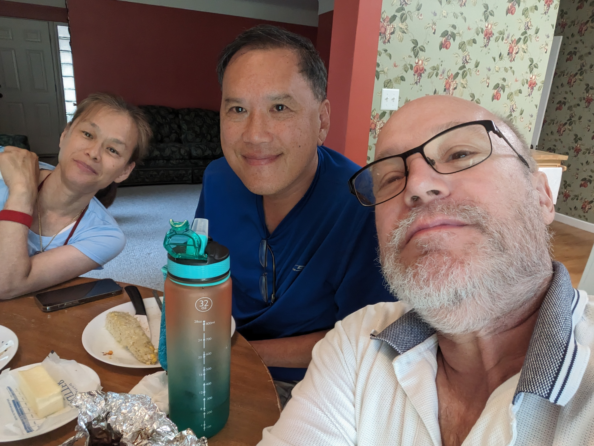
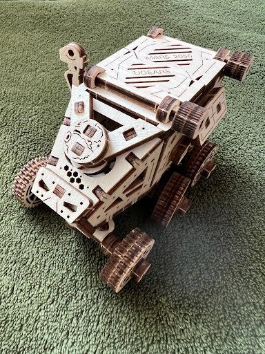
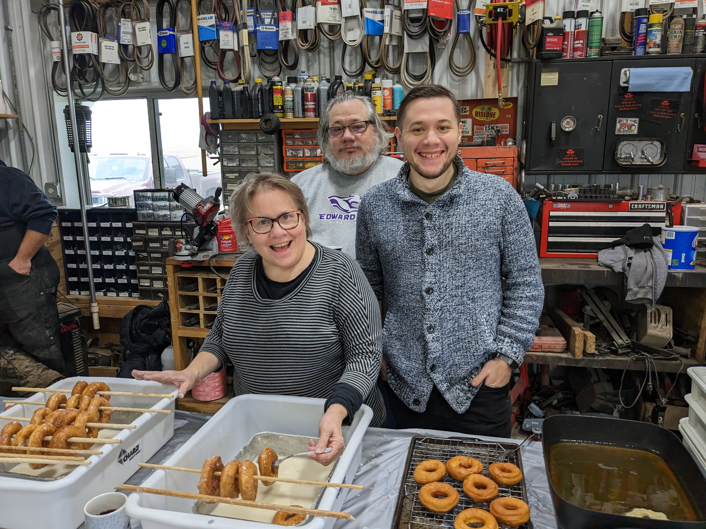
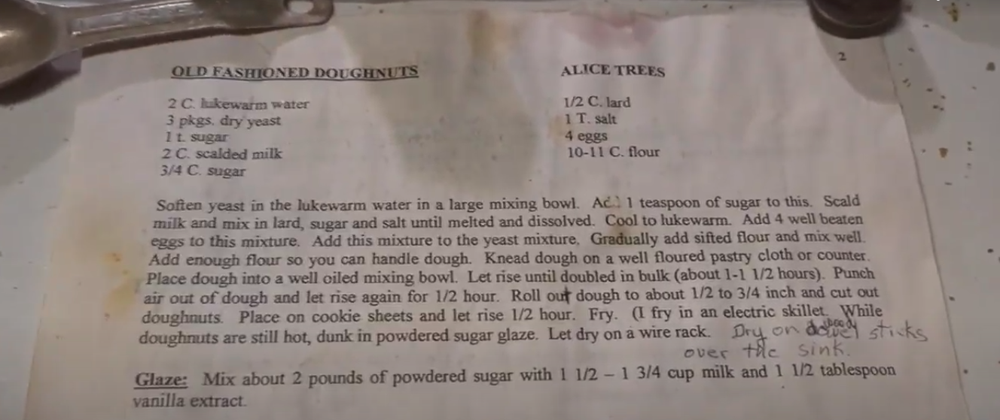
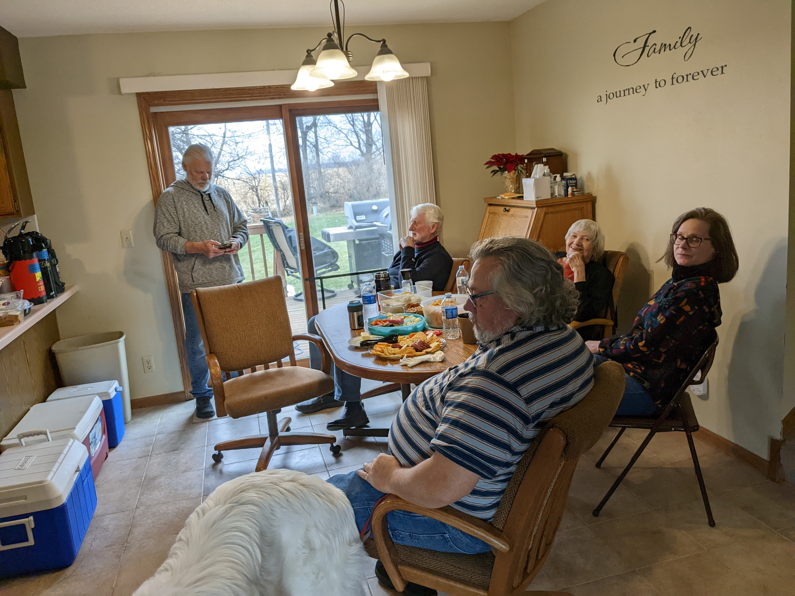
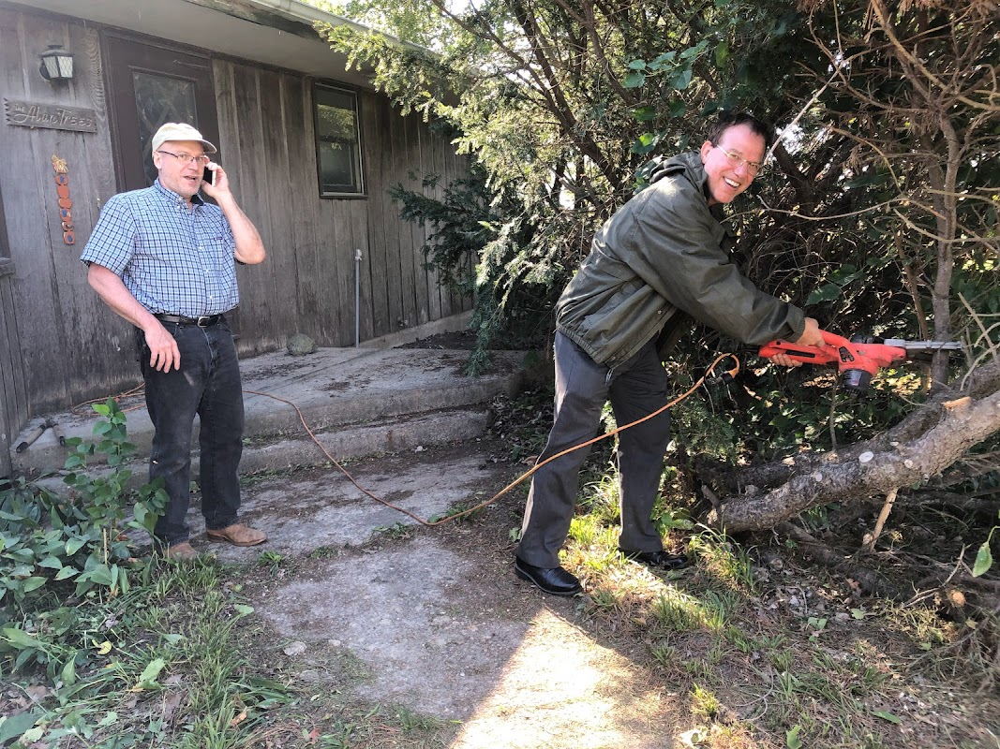

## Welcome Loan (pronounced Lo-wan)
LOAN came to the world, 24th of August, 4.31 pm, 3,8 kg, at the hospital of Annecy.

## 2023.08.19 - Cassy and Justin
- [Photo Album](https://photos.app.goo.gl/NLhCnTUjTzUf26te6)

## 2023.08.10 - Happy Birthday Jennifer

- [Tu share on blog.christrees.com](./share/Tu)
- [Tu Visit - Crooked Creek Days 2023 - Photos](https://photos.app.goo.gl/2CLZpeNsMgv2PpVz9)

## 2023.03.29 [Mom](./share/mom/)

- [Mom digital pics](https://photos.app.goo.gl/aMddCaTmqtoSDgWo8)
- [Mom google pics](https://photos.app.goo.gl/C2qCpRkvkdgWAM3H8)
- [Dad Funeral pics](https://photos.app.goo.gl/QVESNaP4TYDJRT4JA)
- [To Print](https://photos.app.goo.gl/qNGXKJSXy89rp4Mg7)

## [Mom Notes](./share/mom/notes)

- [Mom Notes](./share/mom/notes.md)

## 2023.02.04 Andi's project
Andi assembled Anne's christmas gift.

## 2023 New Year Doughnut Day [more Photos](https://photos.app.goo.gl/TYXZyh8NqAhyKYfcA)

## Happy Holidays 2022

## Christmas Cookies from Trinkala's
Mike and Julie traditional Christmas Package came!

## Thanksgiving 2022 [Turkey Day photos](https://photos.app.goo.gl/WS6y4WRgFWkejYpJ6)

## Vegas 2022.11.14-18 [Vegas Trip photos](https://photos.app.goo.gl/vgwiiCSjQtyjpS1J9)

## Nordyke visit 2022.09.23-25

Brad running late cause had to eat at Riverside.

---

Brad __brushing__ up on surgery skills.

---

## Trink Train and Hike
Trink is on a new train and hike trip.  Click to see the [virtual trip](../share/Trink).

## DP music on Amazon
 - [Offbeats CD Amazon](https://music.amazon.com/albums/B001BVJJPE?ref=dm)
 - [Offbeats CD Spotify](https://open.spotify.com/album/06xAO8JHJK2Ul9Gux3lZBA?si=nTNANDnYR2yRVjjzIfHLQ)
 - [Offbeats CD Apple](https://music.apple.com/us/album/rockn-ska/278620141)

## 10 years ago - Trink Visit 2012
Was cleaning up data and found this photo with May 21, 2012.  I think this was Trink's first visit to Cedar Falls and 2nd to Iowa post 2002 RAGBRAI.

## [2022.04.09 Happy Birthday Anne](https://photos.app.goo.gl/7vh2xduseX7qW6zz9)

## 2022.04.08 Happy Birthday Mom

## [2022.01.01 New Year Doughnut Day](https://photos.app.goo.gl/6BFqK9CZsu2TtYAR6)

[Click here for more New Year Donut Day photos](https://photos.app.goo.gl/6BFqK9CZsu2TtYAR6)

## [2021.12.24 Klopfenstein Christmas](https://photos.app.goo.gl/aXh977Zr6duQZBHz6) "Carol" and "ChrisT"mus Trees

### Christmas Carol

### Grandpa Fred Plywood Christmas Tree

---
[Photo Link to Klopfenstein Christmas 2021](https://photos.app.goo.gl/aXh977Zr6duQZBHz6)
---

## 2021.12.12 Craig elf The Musical Outing
Click here for pictures [https://photos.app.goo.gl/fBo7FrkvUNz3Zn7D7](https://photos.app.goo.gl/fBo7FrkvUNz3Zn7D7)

## 2021.08.21 Craig Ball Park Outing
Click here for pictures [https://photos.app.goo.gl/DFwnv9LcB32nVnE79](https://photos.app.goo.gl/DFwnv9LcB32nVnE79)
Andi's adoptive family "The Craig's" had a baseball outing with the [Cedar Rapids Kernels](https://www.milb.com/cedar-rapids).  Andi fielded a foul ball!  Great time, food, and people to spend a saturday evening with FIREWORKS!!

[Photo Link - https://photos.app.goo.gl/tZs38YK87F8Fahb3A](https://photos.app.goo.gl/tZs38YK87F8Fahb3A)

---
---

## Chris Trees 
  - [Github - christrees](https://github.com/christrees) Github for a geek.
  - [Linkedin - christrees](https://linkedin.com/in/christrees) Linkedin Profile for those types.
  - [Resume PDF - christrees](https://christrees.com/docs/resume_christrees.pdf) Chris Trees - Resume PDF for HR.

  

  
Just a commit to figure out why updates in CND are not working

<!--

[2022.01.09 Notes](/wip/README20220109.md)

## 2021.06.19 Fix'n it for Ken
Click here for link - [http://blog.christrees.com/fix/B&0/](http://blog.christrees.com/fix/B&0/)

I had to channel our old friend Rodger's repair skills... mainly his patience and small parts orgizational skills... and his Ken tollerance of course! 
Thanks Rog!

## 2021.04.11 Feeling burnt out
[Burnout-Attitudes](./Burnout-Attitudes.png)

Going to push on [gh learn-bg-anvil](http://gh.2cld.net/docs/blender/tutorial/learn-bg-anvil).  Need to cleanup my blender links also as I have them in [2cld/gh/docs/blender](https://github.com/2cld/gh/tree/master/docs/blender) and [christrees/blog/blender](https://github.com/christrees/blog/tree/master/blender).  Also need to find and cleanup what I have on the other tests.

## 2021.04.10 Grasshorse Cleanup
The intent today was to move more stuff out of the basement, but it was cold and rainly.  Did stop into the house and the roof is leaking between addition and main old house.  Brad, Brayden and myself then took a stab at grasshorse cleaning.  My goal is to keep defending corners and pushing out.  Brad and I got the SW basement corner cleared.  I intended to trace down the chiller unit as I think I can remove it also.  We took what I think is intended to be trash (the old lights) and sat them on the dock and dock-loading area.  We then moved to the NE basement corner and did a first pass clear and clean.  We started on the woodshop area NE corner.  This is the corner Brayden and I cleared last time, so this was the 'defend and expand'.  We did clear the vertical surfaces we had cleared last time, but at that point I had ran into more signs of non-progress I hit the SNAFU limit.

## 2021.04.09 More Maintainance
Cleared some more basement.  Got to the old leak pipe runs.  Thinking the leak was the laundry water I pulled drywall to get to it.  I think the water actually came from some sort of laundry overflow, not a leak in the supply pipe.  I pulled the washer and found the water was reversed Hot to Cold.  I also found the supply hot hose screen was corroded shut.  I pulled the screens and replace rubber washers.  That seemed to fix the washer.  The dryer vent was off.  I pulled the Dryer, attached the exhaust hoses. There was a lot of lint build up.  I pulled the front face of the dryer and vacumed the lint from everywhere including the felt seals both front and back.  Removing the front also made attaching the exhaust easier.  Dryer worked and also blew out a wad of lint from the exhaust pipe.

## 2021.04.04 Project Catchup
### Update [Blender Learning Project - Youtube](https://youtu.be/05pc088bPlA)
[Blender Learning Project - Youtube](https://youtu.be/05pc088bPlA) overview of what I was doing 6 months ago before I went to [T3 Farms](http://blog.christrees.com/farm/T3Farms/) to help pump poo.  I stopped the blender and the bathroom renovation rendering project.  This is a recap to myself and Gus so he keeps on me to review my progress.  BTW... I should model the new and improved T3 Farms equipment too.

### Update [ConverseHouse Website](https://conversehouse.com/)
I missed Al's email about the Zoom conference Friday night.  So I figured I'd go test the virtual links I setup to test on 2/24.  I added links to meeting rooms that should never expire BUT will require a conversehouse domain user to enter the room and accept any non-members request to enter.  I also added a room via the webapp I experimented with [https://zoom-app-clone.herokuapp.com/conversehouse](https://zoom-app-clone.herokuapp.com/conversehouse).  It mostly works and if people start using it, I'll fix the issues and make it into an app.  I also made the main site secure.
  
## 2021.04.03 - 2021.03.18 - Farm'n and Clean'n
Spend a few weeks down on the farm.
### The Bat Kite
I won the Cub Scout spring kite flying contest with this kite circa 1970... I think.  Found it while cleaning out my basement room at the folks place.

### Clean'n stuff
I reached the far SE corner of the basement!  Moved stuff not touched since 1970's I think.

I also reached the far NE corner, which was the office.  I think the stuff in the corner was placed (by me) in 2004.  Maybe I'll try to find a photo before I cleared.  I only cleared about 1/2 square foot, but I did get to the 2 East corners of the basement.  Now I just have to defend and expand the corners until I clear the entire basement.

## 2021.02.15 - Still cold...

### Digging out in 33 below
Makes me question why 

## 2021.02.09 - Very Cold no rodeo today

## 2020.09.29 - 2020.11.?? 
Farm'n with the Trees side [T3Farms](./farm/T3Farms/).  Cousin [Mike with grandkids](./share/MikeTrees/) Wyate and Drake.

## 2020.08.15 - Derecho info:  
Storm passed north of Winfield, and South of Cedar Falls.  No known farm damage for Mom.  Lots of damage and power out between Cedar Falls and Winfield.  
  <ol> Derecho 2020
    <li><a target="_blank" href="https://www.npr.org/2020/08/16/902868884/the-devastation-is-widespread-iowans-continue-to-struggle-in-aftermath-of-storm">NPR - Derecho aftermath</a></li>
    <li><a target="_blank" href="https://www.npr.org/2020/08/13/902106373/after-devastating-derecho-midwest-takes-stock-of-the-damage">NPR - After Devastating Derecho, Midwest Takes Stock Of The Damage</a></li>
    <li><a target="_blank" href="https://www.thegazette.com/subject/news/iowa-storm-derecho-recovery-cedar-rapids-federal-disaster-aid-national-guard-20200814">The Gazette - Gov. Reynolds</a></li>
    <li><a target="_blank" href="https://www.thegazette.com/derecho-storm-recovery-cleanup-20200815">The Gazette - Saturday Cleanup Cedar Rapids</a></li>
  </ol>
  <ol> Youtube clips
    <li><a target="_blank" href="https://www.youtube.com/watch?v=FYbP_bZvUcg">Live Iowa Derecho Coverage 8/10/20 - KGAN CBS2 Iowa's News Now</a></li>
    <li><a target="_blank" href="https://www.youtube.com/watch?v=pBkPichBlt8">Cedar Rapids Derecho Live Camera Aug 10, 2020</a></li>
    <li><a target="_blank" href="https://www.youtube.com/watch?v=gPdUslndvVI">Cole The Cornstar - Our Farm Got Destroyed</a></li>
    <li><a target="_blank" href="https://www.youtube.com/watch?v=Lw-MkxqYX5k">Cole The Cornstar - Assessing MAJOR Storm Damage</a></li>
    <li><a target="_blank" href="https://www.youtube.com/watch?v=e7M4VG7JpRQ">Cole The Cornstar - Our Worst Crop Ever</a></li>
    <li><a target="_blank" href="https://www.youtube.com/watch?v=q7w2TPgOAi0">How Farms Work - Flat Corn Derecho Farm Damage</a></li>
    <li><a target="_blank" href="https://www.youtube.com/watch?v=n-Z83cn9sck">Car by cornfield</a></li>
    <li><a target="_blank" href="https://www.youtube.com/watch?v=xQNvTqB0NYg">Newton</a></li>
    <li><a target="_blank" href="https://www.youtube.com/watch?v=2mtpj6lZR9M">Des Moines</a></li>
    <li><a target="_blank" href="https://www.youtube.com/watch?v=8fYQOnGt9EI">Dewitt</a></li>
    <li><a target="_blank" href="https://www.youtube.com/watch?v=Bfy4nmpf5Jg">Cedar Rapids</a></li>
    <li><a target="_blank" href="https://www.youtube.com/watch?v=V4YY9YMaQOU">Clinton</a></li>
    <li><a target="_blank" href="https://www.youtube.com/watch?v=qZKxxlFGIDc">Madrid</a></li>
    
  </ol>
  
  

  
## 2019.10.09 Dad
  For info about Dad, [Click here](http://blog.christrees.com/dad/)

  

 
### Scratch space
  <ul>
    <li>Storm on Rownd St <a href="https://photos.app.goo.gl/vFe2VnTEjaBLV5o69">Pictures</a></li>
    <li>Comet Neowise first magnitude from now through July 11; second magnitude from July 12 through July 17 and third magnitude from July 18 through July 22<a href="https://www.space.com/comet-neowise-visibility-july-2020.html">See Link</a></li>
    <li>July 11 - 10 degrees above the northeast horizon, 80 minutes before sunrise</li>
    <li>July 14 its altitude will have already doubled to 10 degrees, and by July 19 it will have doubled yet again to 20 degrees up by the end of nautical twilight.</li>
    <li>On Tuesday morning, July 14, 2020, the planet Jupiter will appear opposite the Sun as seen from the Earth. The best time to look for the planet is between midnight and 2 a.m. (local time) when it is at its highest point in the sky.</li>
    <li>July 10 - Saturn, while not as bright, will be easy to spot as it will be next to Jupiter throughout the entire night. The ringed planet will be reaching opposition about one week after Jupiter on Monday, July 20.</li>
  </ul>

-->

