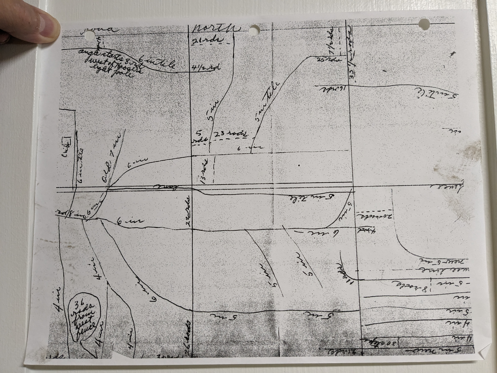

# FHKlopFarms
- old tile sketch I think

# Farm stuff
- Fert plant [Bocking 14 Comfrey](https://www.youtube.com/watch?v=OQvm6sQfiAI)
- [ISU-CustomRates-2025-FM1698.pdf](./ISU-CustomRates-2025-FM1698.pdf) ISU link [ISU-CustomRates-2025-FM1698.pdf](https://isuaamncus122stg.blob.core.windows.net/shop/FM1698.pdf)
- Vote for Zach [Dept of Agriculture Nominee](https://discourse.nomineesforthepeople.com/t/zach-johnson/13418)
- File BOI [https://www.fincen.gov/boi](File BOI https://www.fincen.gov/boi)
- Farm Chat [Video Link](https://meet.google.com/efv-bzzx-pqa)
- Weekly JFT / FH Klop Farms Operations meeting 8PM Sunday
  
## Daily Weekly News
- [ProFarmer.com](https://www.profarmer.com/) [ProFarmer Daily Advice Monitor](https://www.profarmer.com/news/advice-monitor/pro-farmers-daily-advice-monitor)
    - [ProFarmer.com Nov-2023](https://cdn.farmjournal.com/2023-11/Pro%20Farmer%20-%20November%2011,%202023.pdf)
- [Grain Markets - Youtube](https://www.youtube.com/channel/UCcy6azn7vrHgCC-tDMnk6FQ/videos)
- [Farm Progress Daily](https://www.youtube.com/user/FarmProgressDaily/videos)
- [USDA Market News Daily](https://www.ams.usda.gov/mnreports/nw_gr110.txt)
- [AgManagerInfo - Agriculture Today](https://www.youtube.com/user/AgManagerInfo/videos)
- [Market to Market](https://www.youtube.com/c/MarkettoMarket/videos)
- [Weather effects on Market Report](https://www.youtube.com/channel/UCSL03vbUSjnqnFGD7oBpaiw/videos)

## Cash Bid 
- [Agri-Way Wayland](https://www.agriwaypartners.com/)
- [Prairie Ag WMU](https://prairieagcommodities.com/)
- [TriOak Foods](https://trioak.com/grain/bids/iowa/)
- [Farmers Elevator - Wapello](https://farmerseande.com/)
- [Bunge Meekers Landing](https://www.bungeservices.com/irj/portal/anonymous?NavigationTarget=navurl://ecaba8d422883e7dbde99a395f51fb0c#Corn)

## Market Data
- [farmdoc University of Illinois - youtube](https://www.youtube.com/user/farmdocvideo/videos)
    - [2022 - Grain Market Outlook](https://www.youtube.com/watch?v=xSba_pF5sQ8)
- [2022 US Crop Insurance agriculture.com](https://www.agriculture.com/markets)
    - Corn 2022 floor price: $  5.90
    - Bean 2022 floor price: $ 14.33
- [2021 US Crop Insurance agriculture.com](https://www.agriculture.com/markets/newswire/us-crop-insurance-price-guarantees-point-to-higher-soy-corn-acres)
    - Corn 2021 floor price: $  4.58
    - Bean 2021 floor price: $ 11.87
- [Standard Grain Marketing](https://www.standardgrain.com/grain-marketing-plan/)
    - [Grain Markets - Youtube](https://www.youtube.com/channel/UCcy6azn7vrHgCC-tDMnk6FQ/videos)
    - [Discussing Past Grain Sales - Guest Ed Usset](https://www.youtube.com/watch?v=CBj5NUVerwk)
    - [Joe Vaclavik discusses grain markets](https://www.standardgrain.com/podcast/)
- [Advanced Trading Inc](tbd)
    - [Advanced Trading - youtube](https://www.youtube.com/c/AdvanceTradingIncBloomington/videos)
- [Corn Prices 59 Year Historical Chart](https://www.macrotrends.net/2532/corn-prices-historical-chart-data)
- [Corn Futures Contract Profile](https://www.barchart.com/futures/quotes/ZC*0/profile)
- [Soybean Prices 45 Year Historical Chart](https://www.macrotrends.net/2531/soybean-prices-historical-chart-data)
- [Soybean Futures Contract Profile](https://www.barchart.com/futures/quotes/ZS*0/profile)

---
---
## Finance
- [Tile Dranage Finance - ISU](https://www.extension.iastate.edu/agdm/wholefarm/html/c2-90.html)
- [Farm Storage Facility Loan Program](https://www.fsa.usda.gov/programs-and-services/price-support/facility-loans/farm-storage/)
- [Capital Gains and General Tax Structure](https://youtu.be/ezPs4ibFsNU?t=3264)
- [Legacy Plan](https://www.agweb.com/article/5-minute-succession-plan)

## Market Trading
- [Soybean2Corn Price Ratios Projected](https://farmdocdaily.illinois.edu/2017/03/relationships-of-soybean-to-corn-price-ratios.html)
- [Grain Hedgers Guide](https://www.cmegroup.com/trading/agricultural/files/grain-oilseed-hedgers-guide.pdf)
- [Contango Backwardation](https://www.investopedia.com/articles/07/contango_backwardation.asp)
- [Use contango and storge for profit](https://www.investopedia.com/ask/answers/041315/how-can-traders-use-contango-take-advantage-storage-shortage-crude-oil.asp)
- [Hedging vs Speculation](https://www.investopedia.com/ask/answers/difference-between-hedging-and-speculation/)
- [TDAmeritrade - Youtube - Probability Based Option Strategies - Mike Follett](https://www.youtube.com/watch?v=s1Gj8mM-csw)

---
### Farm Links Sort
- [T3 Farms - Pumping Poop](http://blog.christrees.com/farm/T3Farms/)
- [ISU - Shrimp Farm](https://www.amestrib.com/story/business/agricultural/2020/09/25/midland-co-aquaculture-iowa-state-grad-starts-shrimp-farm-former-story-city-outlet-mall/3510095001/)
- [KSU Aquaculture - Growing Shrimp in Bio Flock](https://www.youtube.com/watch?v=IwbDqB0C_-Y)
- [DRI-Stack System - Haber Technologies](https://www.drycorn.com/)
- [PraxiDyn - Mixmate Fusion](https://www.praxidyn.com/)
- [USGS Wind Turbine Database](https://eerscmap.usgs.gov/uswtdb/)
- [USGS Wind Turbine Database around 2000 E Ave Gladbrook](https://eerscmap.usgs.gov/uswtdb/viewer/#10.63/42.1426/-92.7044)
- 42.14655800807075, -92.68819382245098
- [Cole](https://www.google.com/maps/dir//42.1462716,-92.6876252/@42.1462576,-92.6875967,180m/data=!3m1!1e3!4m2!4m1!3e0)
- [Yougblut Ag](https://www.youngblutag.com/)
- [Farmlogs](https://farmlogs.com/)
- [Farmlogs AutoHedge](https://www.autohedgegrain.com/)
- [Bag vs Bin](https://extension.tennessee.edu/publications/Documents/W1060.pdf)
- [Corn Drydown rates](https://www.goldcountryseed.com/en-us/agronomy-library/corn-weights-drydown-rates.html#:~:text=The%20optimum%20harvest%20moisture%20content,is%20around%2023%20to%2025%25.&text=At%20this%20moisture%20content%20range,1%20to%202%25%2Fday.)
- Bin vs Bags [Estimating Costs](https://extension.tennessee.edu/publications/Documents/W1060.pdf)
- [Blender partical dynamics corn fluid flow](https://docs.blender.org/manual/en/2.80/physics/fluid/types/particle.html)
- [corn simulation in auger](https://elibrary.asabe.org/abstract.asp?aid=47268)

### Move or remove
- [Fix AUR graph](https://www.wachete.com/wachet/?share=TWQQQQR92C8T2CLPVNL5EL8J3F3HUVDYBBLGZ8AAENJJN9ZVN4TWRYPZBJN3MJ5PC25RPD787AVDGS3TDD4BM7NX9DT6PCFRCG44RHSDKNYMR47AWA3J564PKXF9C33JAKW9UTUYUGWEJ34SN6B9YLS3GZQSPLPVXL2RCQXCT57J6Q4AMDG9C47HKYN2MJ7K9XRFWQ4MQSH575S4V27JWZZ2VUCFDM4VWF4T4SRJHWJZSTQQQQQEJJAJCQB53RB4M6ZK8LNUSVJ8G5LNA4TUQXZDPCJCWPV2VERPQ4Z)
- [Trink Trip](https://www.amazon.com/photos/groups/RvV85izMQFmuS4DTPSa68g?messageAcntMismatch=true&ref_=pe_3384220_286969100_AP_S_G_AJ_CTA_sharing&contentType=comments&pageIndex=0)
- [Video Streaming rtsp url](https://community.geniusvision.net/platform/cprndr/manurtsp/1972813240772242692)
- [Disaster Recovery Planning with XCP-NG and Xen Orchestra](https://www.youtube.com/watch?v=26hiuEVya50)

### Farm notes to sort
- yale model gdp050tgnuae036 head replacement tutorial [search](https://www.google.com/search?q=yale+model+gdp050tgnuae036+head+replacement+tutorial&client=safari&sca_esv=7e140dff066c04a6&rls=en&sxsrf=ACQVn0--w-k6jtdbwOvlkJrXxqW2R3Oe5g%3A1710798355991&ei=E7b4Za6KPJCMm9cPh_a_0AY&ved=0ahUKEwju36nC5P6EAxUQxuYEHQf7D2oQ4dUDCA8&uact=5&oq=yale+model+gdp050tgnuae036+head+replacement+tutorial&gs_lp=Egxnd3Mtd2l6LXNlcnAiNHlhbGUgbW9kZWwgZ2RwMDUwdGdudWFlMDM2IGhlYWQgcmVwbGFjZW1lbnQgdHV0b3JpYWwyCBAAGIAEGKIEMggQABiJBRiiBDIIEAAYgAQYogQyCBAAGIAEGKIESJElUIgIWMwicAZ4AZABAJgBxAGgAaILqgEEMC4xMLgBA8gBAPgBAZgCD6ACywrCAgoQABhHGNYEGLADwgIEECEYFcICBxAhGAoYoAHCAgUQIRigAZgDAIgGAZAGCJIHAzYuOaAH4SQ&sclient=gws-wiz-serp#imgrc=EWEsnsYd-NwCPM&imgdii=4_3-AQLk2NjGwM)
- Yale [ Head Gasket Replacement](https://www.youtube.com/watch?v=PC1thVT2Zqo) and  [Video 2](https://www.youtube.com/watch?app=desktop&v=q6ox8yvcFvI)
- Yale [YALE FORKLIFT TRUCK GP050TE,GP050TF,GP050TG,GP055TG,GP060TE ENGINE GASKET SET](https://www.ebay.com/itm/193314354889)
