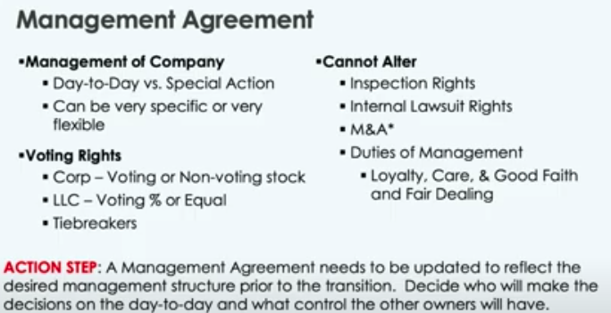
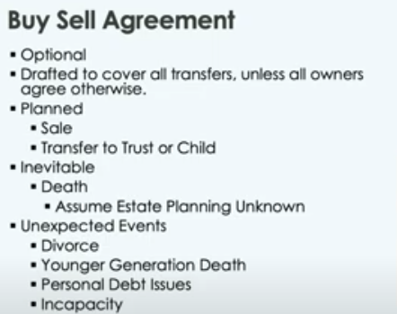
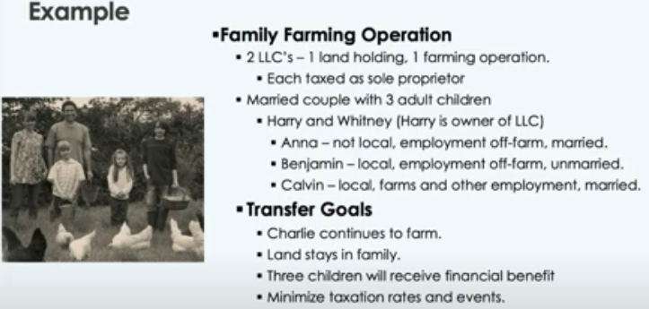
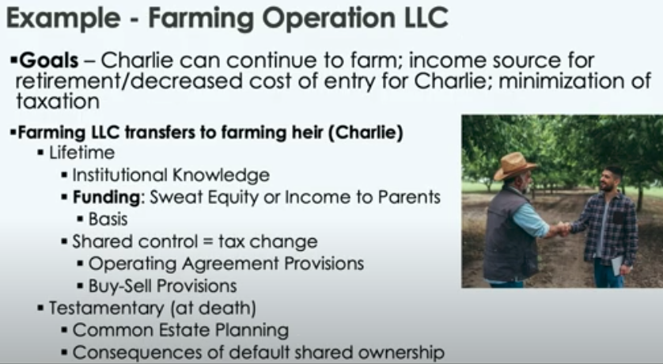
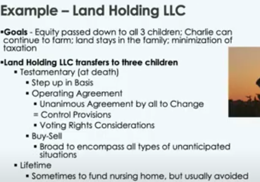

## Farm LLC planning
[edit](https://github.com/christrees/blog/edit/master/farm/llc.md)

## New info
- [A Guide to Filing Taxes after Someone Dies](https://everloved.com/articles/post-death-logistics/a-guide-to-filing-taxes-after-someone-dies/?gad=1&gclid=CjwKCAjwpayjBhAnEiwA-7ena3Yp7JuFygMVCSCUVdrfQCvCNYYF_CjPlhSiaIVp57lwq0dR7asiVhoCbhoQAvD_BwE)
- [Limited Liability Company Federal EIN Application](https://irs-federal-ein-number.com/form/limited-liability-company)
- [How to Report a Death to Credit Bureaus](https://everloved.com/articles/post-death-logistics/how-to-report-a-death-to-credit-bureaus/)
- [Iowa Attorney General - steps-following-the-death-of-a-loved-one](https://www.iowaattorneygeneral.gov/for-consumers/general-consumer-information/steps-following-the-death-of-a-loved-one)
- [tbd]()

--- 
Credit Agencies
In the requests, include the following information about the loved one: 

- Legal Name 
- Social Security Number 
- Date of Birth 
- Date of Death 
- Last known address 
- A copy of the death certificate 

Also include the following information about yourself: 
- Legal Name 
- Copy of identification, such as driver’s license 
- Current Address 
- Copy of Letters Testamentary, Power of Attorney, or other legal documentation with a court seal indicating you are the executor of the estate. 

- Experian: P.O. Box 9701 Allen, TX 75013
- Equifax: P.O. Box 105139 Atlanta, GA 30348
- TransUnion: P.O. Box 2000 Chester, PA 19016 

---
- June 5, 2023 2.40pm - Called Haggie Ins, confirmed personal property and house coverage is paid for year $2,074.00 was in bank etf
- June 5, 2023 2pm - Called IowaDOT 515.244.9124 - Confirmed IowaDOT has Deceased.
  - Sanction
    - Cust No: 568264. DL No: xxxxxx 
    - Date: 4.18.2023 
    - Sanction No: 4646407
  - Re-Exam 
    - Cust No: 568264. DL No: xxxxxx
    - Date: 3.22.2023
    - CaseNo: 956289
- June 5, 2023 8am - Carla called and will be paying $7,583.64 Snyder Funeral Home
---

- [https://www.seialaw.com/attorneys/sara-l-haas/](https://www.seialaw.com/attorneys/sara-l-haas/)

```
Sara L. Haas
Member
```
```
shaas@seialaw.com
```
```
319-754-6587
```
```
319-754-7514 fax
```

- [https://www.linkedin.com/in/andy-harris-11a08230](https://www.linkedin.com/in/andy-harris-11a08230)

```
Andy Harris
```
```
(515) 460-3100 
```
(personal cell I think)
```
AHarris@hoganhansen.com
```

---
---

## LLC for Alice Trees 80acre Farm Land
- Parcel Data from [https://www.iowatreasurers.org/index.php?module=schedules](https://www.iowatreasurers.org/index.php?module=schedules)
- Parcel barn and grass ?
```
County:Louisa,IA
Parcel:0633201000
Details:TREES, ALAN V. & ALICE A.
7783 COUNTY RD W66
74,IA
NW NE
```

- Parcel 76 Farm Land only ?
```
County:Louisa,IA
Parcel:0633251000
Details:TREES, ALAN V. & ALICE A.

74,IA
SW NE
```

Name suggestions:
- FH Klopfenstein Farms, LLC
- Intention is a farm land holding for generational sustainablity.

### Operation Agreement
- 3 parnters (Carla, Chris, Carol)
- Carla Trees
```
Carla Trees
2392 105th St 
Winfield, IA 52659
Email: carlatrees@gmail.com
Phone: (319) 461-5170
```
- Chris Trees
```
Chris Trees
2416 Rownd St. 
Cedar Falls, IA 50613
Email: christrees@gmail.com
Phone: (515) 999-0007
```
- Carol Fletcher
```
Carol Fletcher
2821 Horseshoe Drive
Cedar Falls, IA 50613
Email: carol.fletcher@uni.edu
Phone: 319-231-7475
```
- Yearly approval of the following before April 8 each year.
  - Operational agreement Agenda
    - Crop year operation contract approval
    - Crop year budget plan approval
    - Crop year manager approval
  - Buy-Sell agreement Agenda 
    - Crop year marketing contract approval (grain buy sell)
    - Land and Capital improvements budget plan approval
    - LLC asset buy and sell approval
    - Partner voting and investment share exchange approval
    - Accountant manager approval
- LLC meets to elect Farm Manager (Kenton)
- LLC applies to obtain farm loan to tile and pay operational cost for current and planting pre-purchase (est 100K - 250K)
- Contribution value (est 750K) 750 shares
  - Carla  250 shares 
  - Chris  250 shares 
  - Carol  250 shares 
- Investment shares are structured to allow transfer ownsership and operations to minimizing tax issues.
- The intention is to have hire Klopfenstien Ag LLC for custom farming managed by Farm Manager (Kenton).

### Buy Sell Agreement
- All partners have first right of refusal to any and all external buy or sell agreements.
- All partners have the right to maintain their existing investment equity precentage.
- In the case of an LLC liquidation event, funds will be distributed via LLC member share percentage on record at the time of the liquidation.
- LLC recored will be filed with Sara ? or lockbox at bank ?

---
---

## LLC for Alice Trees 20acre Residential and Farm Land
- Parcel Data from [https://www.iowatreasurers.org/index.php?module=schedules](https://www.iowatreasurers.org/index.php?module=schedules)
- Parcel Folks House
```
County:Henry,IA
Parcel:000000030453000
Details:Trees, Alan V & Alice A
2378 120TH ST
WINFIELD ,IA
W 1/2 NE NE EX NE PTALSO 0.726A TRACT E MID PT W 1/2 NE NE
```
- Parcel Rental
```
County:Henry,IA
Parcel:000000030191000
Details:Trees, Alan V & Alice A
2384 120TH ST
WINFIELD ,IA
NE PT W 1/2 NE NE
```

Name suggestion:
- Trees AES, LLC 
- Intention is a Residential Realestate Investment holding in the Winfield area.

### Operation Agreement
- 3 parnters (Carla, Chris, Carol)
- Carla Trees
```
Carla Trees
2392 105th St 
Winfield, IA 52659
Email: carlatrees@gmail.com
Phone: (319) 461-5170
```
- Chris Trees
```
Chris Trees
2416 Rownd St. 
Cedar Falls, IA 50613
Email: christrees@gmail.com
Phone: (515) 999-0007
```
- Carol Fletcher
```
Carol Fletcher
2821 Horseshoe Drive
Cedar Falls, IA 50613
Email: carol.fletcher@uni.edu
Phone: 319-231-7475
```
- Yearly approval of LLC Operational Manager made on or before April 8 each year for current year and next year property improvements
  - Operational voting Agenda
    - Rental year operation contract approval
    - Rental year budget plan approval
    - Rental year manager approval
  - Investment voting Agenda 
    - Land and Capital improvements budget plan approval
    - LLC asset buy and sell approval
    - Partner voting and investment share exchange approval
    - Accountant manager approval
- LLC meets to elect Rental Manager and applies for loan to pay for improvements and operational cost for the  year.
- Contribution value (est 325K) and Cash (est 50K) brings net assets of LLC to 375K / 375 shares
  - Carla  125 shares (loan debt share)
  - Chris  125 shares (loan debt share)
  - Carol  125 shares (loan debt share)
- The intention is to protect members from direct ownership liablity.
- The intention is to re-invest revenue into maintainance and capital improvements.
- LLC is responsible for capital improvements.
- LLC is responsible for operational costs.

### Buy Sell Agreement
- All partners have first right of refusal to any external buy or sell agreements.
- All partners have the right to keep their existing investment equity precentage.
- In the case of an LLC liquidation event, funds will be distributed via LLC member investment percentage on record at the time of the liquidation.
- LLC recored will be filed with Sara ? or lockbox at bank ?

----
----

## Reference and Iowa State Ag Law and Tax conference

- [https://www.outsystems.com/company/why-outsystems/](https://www.outsystems.com/company/why-outsystems/)

- [https://www.kiplinger.com/retirement/estate-planning/604612/keeping-property-in-the-family-with-llcs-and-partnerships](https://www.kiplinger.com/retirement/estate-planning/604612/keeping-property-in-the-family-with-llcs-and-partnerships)

- Iowa State Ag Law and Tax [Entities to Grow or Transfer](https://www.calt.iastate.edu/using-business-entities-grow-or-transfer-business-0)
- General Partnership [video tc 6:48](https://youtu.be/xqNulmE6jtk?t=408) LLC limits personal liablity
- Limited Partnership [video tc 9:13](https://youtu.be/xqNulmE6jtk?t=553) Iowa code chapter 488 liablity only up to contribution
- Partnership Taxation [video tc 10:38](https://youtu.be/xqNulmE6jtk?t=638) Must file Form 1065 along with K-1's
- Tax Transfer Section 754 election [video tc 12:41](https://youtu.be/xqNulmE6jtk?t=761)
- LLC Iowa Code ch. 489 [video tc 21:06](https://youtu.be/xqNulmE6jtk?t=1266)
- LLC can prevent forced partition (aka court ordered selling) like tennates in common [video tc 23:25](https://youtu.be/xqNulmE6jtk?t=1405)
- Careful, you need reasonable expections
- Valuation Discounts [video tc 26:32](https://youtu.be/xqNulmE6jtk?t=1592) up to 30% minority discount owner
  
- Important Documents to have in LLC [video tc 27:42](https://youtu.be/xqNulmE6jtk?t=1662)
  - Managment / Operating Agreement (offically an article of organization and bylaws)
  - Buy-Sell Agreement (optional but do it)
  - Default is Iowa Code Chapter 498a (Iowa Business Act / LLC)
  - [video tc 31:23](https://youtu.be/xqNulmE6jtk?t=1883) LLC Management Agreement Outline and [video tc 33:22](https://youtu.be/xqNulmE6jtk?t=2002) LLC Buy Sell Agreement
     
  - tbd
- The Five Important Decisions [video tc 34:18](https://youtu.be/xqNulmE6jtk?t=2058)
  1. Who will be able to purchase [video tc 34:18](https://youtu.be/xqNulmE6jtk?t=2058)
  2. Timeframe of the Transfer [video tc 35:53](https://youtu.be/xqNulmE6jtk?t=2153)
  3. Price Determination [video tc 37:00](https://youtu.be/xqNulmE6jtk?t=2220)
  4. When will the agreement apply [video tc 39:47](https://youtu.be/xqNulmE6jtk?t=2387)
  5. Funding the Transaction [video tc 42:26](https://youtu.be/xqNulmE6jtk?t=2546)

- Example of typical Farm LLC structure [video tc 43:54](https://youtu.be/xqNulmE6jtk?t=2634)


- Example Farm Operation LLC [vidoe tc 46:11](https://youtu.be/xqNulmE6jtk?t=2771)


- Example Farm Land LLC [vidoe tc 48:56](https://youtu.be/xqNulmE6jtk?t=2936)


- Talks about flexiblity in share rights, restriction is minority oppression [video tc 57:11](https://youtu.be/xqNulmE6jtk?t=3431) must have a reasonable exit for all shares.

---
- when to swithch from llc to s-corp > $45K [youtube llc to s-corp and c-corp](https://www.youtube.com/watch?v=LUpyc89bgBU)
- business structures and [loans](https://www.youtube.com/@andrewcartwright/videos)


Questions:
- Valuation Discounts how to use them [video tc 27:06](https://youtu.be/xqNulmE6jtk?t=1626)

---
## Grain Marketing
1. Set a minimum sell price based on your cost of production and set a realistic high price. 
2. Estimate how many bushels would be 70% of your average production.
3. In April, May and June, make seven sales (70% of production divided by 10) when prices are within your price range.
4. On July 1, price any remaining portions of that 70%.
5. For the remaining 30% of your grain, develop a postharvest marketing plan.  
