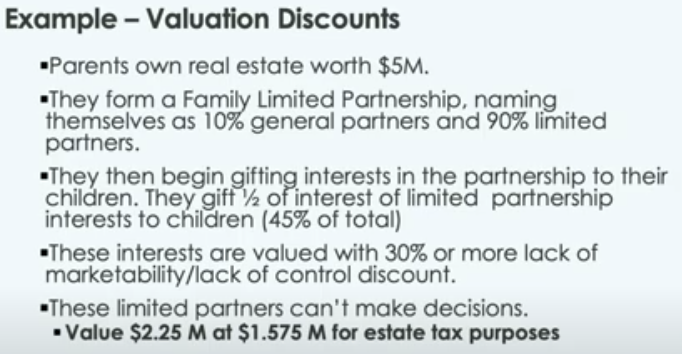

## Farm LLC planning
[edit](https://github.com/christrees/blog/edit/master/farm/llc.md)

- [https://www.seialaw.com/attorneys/sara-l-haas/](https://www.seialaw.com/attorneys/sara-l-haas/)

```
Sara L. Haas
Member
```
```
319-754-6587
```
```
319-754-7514 fax
```

- [https://www.linkedin.com/in/andy-harris-11a08230](https://www.linkedin.com/in/andy-harris-11a08230)

```
Andy Harris
```
```
(515) 460-3100 
```
(personal cell I think)
```
AHarris@hoganhansen.com
```

Name suggestions:
- FH Klopfenstein Farm, LLC
- FH Klopfenstein Farm, LLC

- DONE ~~USDA 2022 Census of Agriculture due Feb 6~~

### Operation Agreement
- 5 parnters (Alice, Carla, Chris, Carol, Kenton)
  - Alice Trees 
    - 2378 120th St. Winfield Iowa 52659
    - altrees@outlook.com
    - (319) 257-6873
  - Carla Trees
    - ? Winfield Iowa 52659
    - carlatrees@gmail.com
    - (319) 461-5170
  - Chris Trees
    - 2416 Rownd St. Cedar Falls Iowa 60613
    - christrees@gmail.com
    - (515) 999-0007
  - Carol Fletcher
    - ??? Horseshoe Dr. Cedar Falls Iowa 60613
    - carol.fletcher@uni.edu
    - ‪(319) 231-7475
  - Kenton Klopfenstein
    - ? Winfield Iowa 52659
    - kpklopfenstein@gmail.com
    - (319) 750-0665
- 2 types of shares, Operational and Investment.
- Yearly approval of Farm Manager made on or before April 8 each year for current year and next year land improvements and planting pre-purchase.
  - Operational voting Agenda
    - Crop year operation contract approval
    - Crop year budget plan approval
    - Crop year manager approval
  - Investment voting Agenda 
    - Crop year marketing contract approval (grain buy sell)
    - Land and Capital improvements budget plan approval
    - LLC asset buy and sell approval
    - Partner voting and investment share exchange approval
    - Accountant manager approval
- Alice contribues Klop80 farm land to LLC (check with Andy Harris on Tax)
- LLC meets to elect Farm Manager (Kenton) and applies to obtain farm loan to tile and pay operational cost for current and planting pre-purchase (est 100K - 250K)
- Contribution value (est 750K) and Loan (est 250K) brings net assets of LLC to 1M / 1000 share voting 1000 share investment
  - Alice 800 shares voting and investment
  - Carla  50 shares voting and investment
  - Chris  50 shares voting and investment
  - Carol  50 shares voting and investment
  - Kenton 50 shares voting and investment
- Investment shares are structured to allow Alice to transfer ownsership and operations to other LLC members while minimizing tax issues.
- THe intention is to have Alice assign voting shares to others that which removes her from direct operation responsiblities.
- As Tax and ownship rules allow, Alice starts to transfer and or sell investment shares as needed.

### Buy Sell Agreement
- All partners have first right of refusal to any external buy or sell agreements.
- All partners have the right to keep their existing investment equity precentage.
- In the case of an LLC liquidation event, funds will be distributed via LLC member investment percentage on record at the time of the liquidation.
- LLC recored will be filed with Sara ? or lockbox at bank ?


## House LLC planning
Name suggestion:
- Trees AES, LLC or... Trees AeeeS Trees Ae3 (Trees Aging (Engineering)(Environment)(Education) Services)
- Intention is a Realestate Investment holding to improve Aging living environment in the Winfield area.

### Operation Agreement
- 5 parnters (Alice, Carla, Chris, Carol, Brad/Carmen)
  - Alice Trees 
    - 2378 120th St. Winfield Iowa 52659
    - altrees@outlook.com
    - (319) 257-6873
  - Carla Trees
    - ? Winfield Iowa 52659
    - carlatrees@gmail.com
    - (319) 461-5170
  - Chris Trees
    - 2416 Rownd St. Cedar Falls Iowa 60613
    - christrees@gmail.com
    - (515) 999-0007
  - Carol Fletcher
    - ??? Horseshoe Dr. Cedar Falls Iowa 60613
    - carol.fletcher@uni.edu
    - ‪(319) 231-7475
  - Brad Nordyke ??
    - ? Winfield Iowa 52659
    - kpklopfenstein@gmail.com
    - (319) 750-0665
- 2 types of shares, Operational and Investment.
- Yearly approval of Farm Manager made on or before April 8 each year for current year and next year property improvements
  - Operational voting Agenda
    - Rental year operation contract approval
    - Rental year budget plan approval
    - Rental year manager approval
  - Investment voting Agenda 
    - Land and Capital improvements budget plan approval
    - LLC asset buy and sell approval
    - Partner voting and investment share exchange approval
    - Accountant manager approval
- Alice contribues Homeplace land and houses to LLC (check with Andy Harris on Tax)
- LLC meets to elect Rental Manager (Carmen ??) and applies to loan to pay operational cost for the  year (est 50K - 175K)
- Contribution value (est 325K) and Loan (est 175K) brings net assets of LLC to 500K / 500 share investment
  - Alice 325 shares 
  - Carla  25 shares 
  - Chris  25 shares 
  - Carol  25 shares 
  - Brad  100 shares 
- Investment shares are structured to allow Alice to transfer ownsership to other LLC members while minimizing tax issues.
- The intention is to have Alice assign voting shares to others that which removes her from direct ownership liablity.
- As Tax and ownship rules allow, Alice becomes a renter of property (aka reverse mortgage).

### Buy Sell Agreement
- All partners have first right of refusal to any external buy or sell agreements.
- All partners have the right to keep their existing investment equity precentage.
- In the case of an LLC liquidation event, funds will be distributed via LLC member investment percentage on record at the time of the liquidation.
- LLC recored will be filed with Sara ? or lockbox at bank ?


- [https://www.outsystems.com/company/why-outsystems/](https://www.outsystems.com/company/why-outsystems/)

- [https://www.kiplinger.com/retirement/estate-planning/604612/keeping-property-in-the-family-with-llcs-and-partnerships](https://www.kiplinger.com/retirement/estate-planning/604612/keeping-property-in-the-family-with-llcs-and-partnerships)

- Iowa State Ag Law and Tax [Entities to Grow or Transfer](https://www.calt.iastate.edu/using-business-entities-grow-or-transfer-business-0)
- General Partnership [video tc 6:48](https://youtu.be/xqNulmE6jtk?t=408) LLC limits personal liablity
- Limited Partnership [video tc 9:13](https://youtu.be/xqNulmE6jtk?t=553) Iowa code chapter 488 liablity only up to contribution
- Partnership Taxation [video tc 10:38](https://youtu.be/xqNulmE6jtk?t=638) Must file Form 1065 along with K-1's
- Tax Transfer Section 754 election [video tc 12:41](https://youtu.be/xqNulmE6jtk?t=761)
- LLC Iowa Code ch. 489 [video tc 21:06](https://youtu.be/xqNulmE6jtk?t=1266)
- LLC can prevent forced partition (aka court ordered selling) like tennates in common [video tc 23:25](https://youtu.be/xqNulmE6jtk?t=1405)
- Careful, you need reasonable expections
- Valuation Discounts [video tc 26:32](https://youtu.be/xqNulmE6jtk?t=1592) up to 30% minority discount owner
  
- Important Documents to have in LLC [video tc 27:42](https://youtu.be/xqNulmE6jtk?t=1662)
  - Managment / Operating Agreement (offically an article of organization and bylaws)
  - Buy-Sell Agreement (optional but do it)
  - Default is Iowa Code Chapter 498a (Iowa Business Act / LLC)
  - [video tc 31:23](https://youtu.be/xqNulmE6jtk?t=1883) LLC Management Agreement Outline and [video tc 33:22](https://youtu.be/xqNulmE6jtk?t=2002) LLC Buy Sell Agreement
     
  - tbd
- The Five Important Decisions [video tc 34:18](https://youtu.be/xqNulmE6jtk?t=2058)
  1. Who will be able to purchase [video tc 34:18](https://youtu.be/xqNulmE6jtk?t=2058)
  2. Timeframe of the Transfer [video tc 35:53](https://youtu.be/xqNulmE6jtk?t=2153)
  3. Price Determination [video tc 37:00](https://youtu.be/xqNulmE6jtk?t=2220)
  4. When will the agreement apply [video tc 39:47](https://youtu.be/xqNulmE6jtk?t=2387)
  5. Funding the Transaction [video tc 42:26](https://youtu.be/xqNulmE6jtk?t=2546)

- Example of typical Farm LLC structure [video tc 43:54](https://youtu.be/xqNulmE6jtk?t=2634)


- Example Farm Operation LLC [vidoe tc 46:11](https://youtu.be/xqNulmE6jtk?t=2771)


- Example Farm Land LLC [vidoe tc 48:56](https://youtu.be/xqNulmE6jtk?t=2936)


- Talks about flexiblity in share rights, restriction is minority oppression [video tc 57:11](https://youtu.be/xqNulmE6jtk?t=3431) must have a reasonable exit for all shares.


Questions:
- Valuation Discounts how to use them [video tc 27:06](https://youtu.be/xqNulmE6jtk?t=1626)
