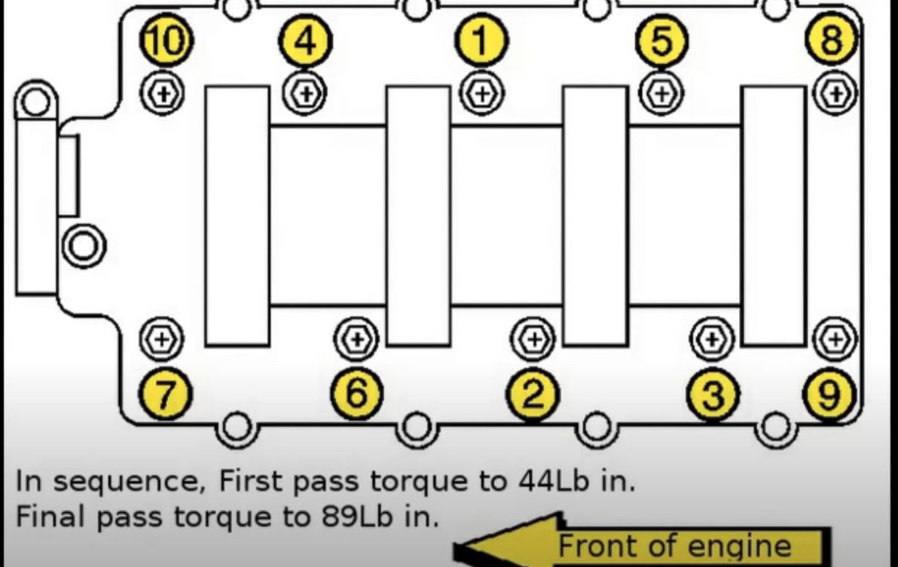

# Repairs

- 11 Ft-Lbs or 132 In-Lbs torque

- First Pass 44 Lb
- Final Pass 89 Lb

## [GM 3.8L 3800 Series II engine upper and lower intake manifold & valve cover gasket replacement](https://www.youtube.com/watch?v=nsh-3dBJjrk)

<iframe src="https://www.youtube.com/embed/nsh-3dBJjrk" frameborder="0" allow="accelerometer; autoplay; clipboard-write; encrypted-media; gyroscope; picture-in-picture" allowfullscreen></iframe>

    1. [Intake Torque Diagram tc21:05](https://youtu.be/nsh-3dBJjrk?t=1265)
    2. [New Waterpump pipes on tensionor assembly tc22:57](https://youtu.be/nsh-3dBJjrk?t=1377)
    3. [Put back bracket, altenator, belt  and wire harness bracket tc24:06](https://youtu.be/nsh-3dBJjrk?t=1446)
    4. [Put back metal EGR pipe tc]()
    5. [Prep upper intake gaskets and pcv tc25:17](https://youtu.be/nsh-3dBJjrk?t=1517)
    6. [Upper Intake Torque pattern and spec tc32:43](https://youtu.be/nsh-3dBJjrk?t=1963)
    7. [Replace fuel rail O-rings tc33:33](https://youtu.be/nsh-3dBJjrk?t=2013)
    8. [Clean up throttle body and mount tc39:07](https://youtu.be/nsh-3dBJjrk?t=2347)
    9. [Flush with watter without termostat first tc41:45](https://youtu.be/nsh-3dBJjrk?t=2516)

[Account at 1aauto](https://www.1aauto.com/account) - christrees-gmail and -yahoo

[1A Auto - Intake Manifold](https://www.1aauto.com/search?q=intake+manifold+gasket+set&year=2002&model=141&searchQuery=intake+manifold+gasket+set)

[AutoZone - Intake Manifold](https://www.autozone.com/external-engine/intake-manifold/dorman-intake-manifold-615-180/465215_0_0)

## Rebuilding 3800 Injectors [youtube](https://www.youtube.com/watch?v=kuB12b2flx0)

## Chevy 3.8L Upper + Lower Intake Manifold Gasket and Tensioner Replacement
1. [Chevy 3.8L Upper + Lower Intake Manifold Gasket and Tensioner Replacement Part 1](https://www.youtube.com/watch?v=gTLvnYVmrNQ)

<iframe src="https://www.youtube.com/embed/gTLvnYVmrNQ" frameborder="0" allow="accelerometer; autoplay; clipboard-write; encrypted-media; gyroscope; picture-in-picture" allowfullscreen></iframe>

    1. [ tc]()
    2. [ tc]()
    3. [ tc]()
    4. [ tc]()

2. [Chevy 3.8L Upper + Lower Intake Manifold Gasket and Tensioner Replacement Part 2](https://www.youtube.com/watch?v=1OtGtTF87mQ)

<iframe src="https://www.youtube.com/embed/1OtGtTF87mQ" frameborder="0" allow="accelerometer; autoplay; clipboard-write; encrypted-media; gyroscope; picture-in-picture" allowfullscreen></iframe>

    1. [ tc]()
    2. [ tc]()
    3. [ tc]()
    4. [ tc]()

3. [Chevy 3.8L Upper + Lower Intake Manifold Gasket and Tensioner Replacement Part 3](https://www.youtube.com/watch?v=o46uyH84TAE)
<iframe src="https://www.youtube.com/embed/o46uyH84TAE" frameborder="0" allow="accelerometer; autoplay; clipboard-write; encrypted-media; gyroscope; picture-in-picture" allowfullscreen></iframe>

    1. [ tc]()
    2. [ tc]()
    3. [ tc]()
    4. [ tc]()

## [GM 3.8L 3800 Series II engine upper and lower intake manifold & valve cover gasket replacement](https://www.youtube.com/watch?v=nsh-3dBJjrk)

<iframe src="https://www.youtube.com/embed/nsh-3dBJjrk" frameborder="0" allow="accelerometer; autoplay; clipboard-write; encrypted-media; gyroscope; picture-in-picture" allowfullscreen></iframe>

## [1A Auto - How to Replace Intake Manifold 96-05 Buick LeSabre](https://www.youtube.com/watch?v=8uoqAcX5MWk)

<iframe src="https://www.youtube.com/embed/8uoqAcX5MWk" frameborder="0" allow="accelerometer; autoplay; clipboard-write; encrypted-media; gyroscope; picture-in-picture" allowfullscreen></iframe>

## [1A Auto - How to Replace Intake Manifold 96-05 Buick LeSabre](https://www.youtube.com/watch?v=8uoqAcX5MWk)

<iframe src="https://www.youtube.com/embed/8uoqAcX5MWk" frameborder="0" allow="accelerometer; autoplay; clipboard-write; encrypted-media; gyroscope; picture-in-picture" allowfullscreen></iframe>

## [Water Pump Replacement (04 Buick LaSabre 3.8 V6)](https://www.youtube.com/watch?v=pNJYL4rM4Ss)

<iframe src="https://www.youtube.com/embed/pNJYL4rM4Ss" frameborder="0" allow="accelerometer; autoplay; clipboard-write; encrypted-media; gyroscope; picture-in-picture" allowfullscreen></iframe>

## [96 - 05 Buick Lasabre - Water Pump Replacement + Great Tips](https://www.youtube.com/watch?v=neeh7AE-xSY)

<iframe src="https://www.youtube.com/embed/neeh7AE-xSY" frameborder="0" allow="accelerometer; autoplay; clipboard-write; encrypted-media; gyroscope; picture-in-picture" allowfullscreen></iframe>
