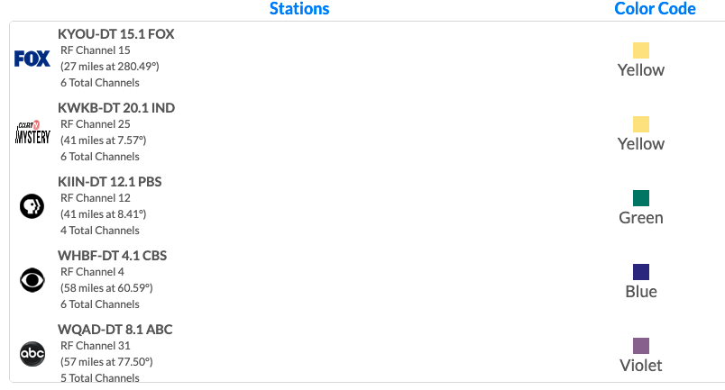
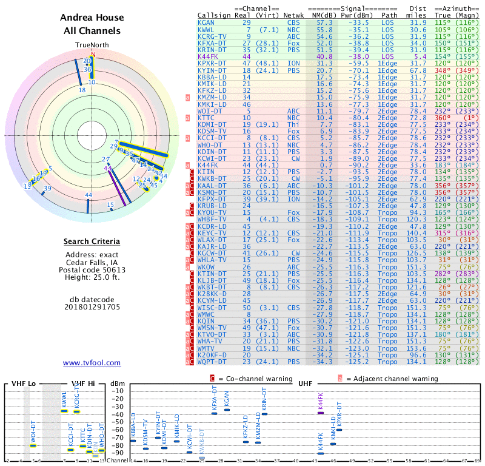
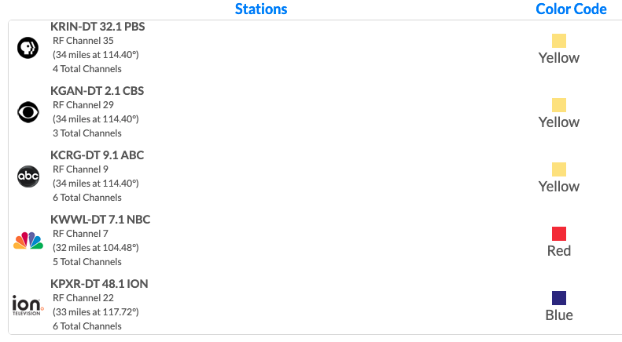
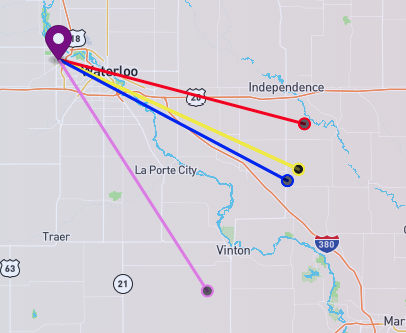

# Media Efforts

## Locast [https://www.locast.org/](https://www.locast.org/)
- locast2plex for DVR github [https://github.com/tgorgdotcom/locast2plex](https://github.com/tgorgdotcom/locast2plex)
- locast2plex for DVR docker [https://hub.docker.com/r/tgorg/locast2plex](https://hub.docker.com/r/tgorg/locast2plex)
    - File expected in container mount path /app/config.ini
    ```
    [main]
    plex_accessible_ip = 127.0.0.1
    locast_username =
    locast_password =
    tuner_count = 4
    uuid = <generated>
    ```
    - pass port 6077 through docker to host
    - tbd
- tbd

## Antenna
- [Clearstream outdoor](https://www.amazon.com/ClearStream-Indoor-Outdoor-Antenna-Mount/dp/B00SVNKT86)
- [ANTOP AT-500BV](https://www.amazon.com/ANTOP-AT-400BV-Smartpass-Amplifier-Enhanced/dp/B07Z3KYCVD)
- [TV Fool - Transmitter Search](http://tvfool.com/)
    - [Winfield Search](http://www.tvfool.com/?option=com_wrapper&Itemid=29&q=id%3d90382bcea07e53) 
    - 
    - [Antennaweb.org](https://www.antennaweb.org/results)
    - 
    - 
    - 
    - [CedarFalls Search](http://www.tvfool.com/?option=com_wrapper&Itemid=29&q=id%3d9038aa94e71b66) 
    - 
    - [Antennaweb.org](https://www.antennaweb.org/results)
    - 
    - 


## Silicon Dust

## Plex

