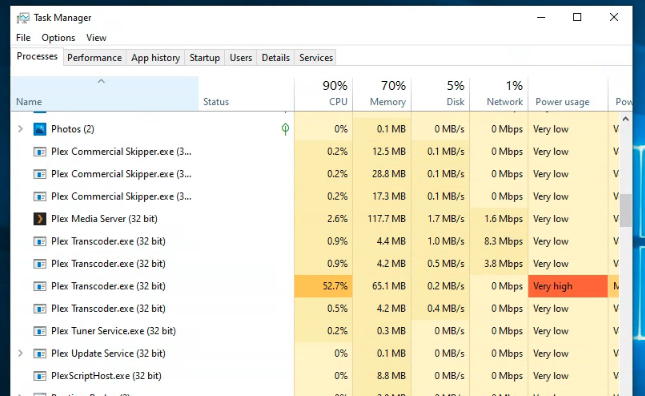
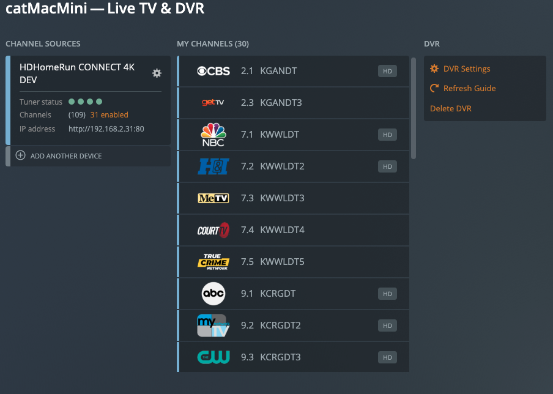
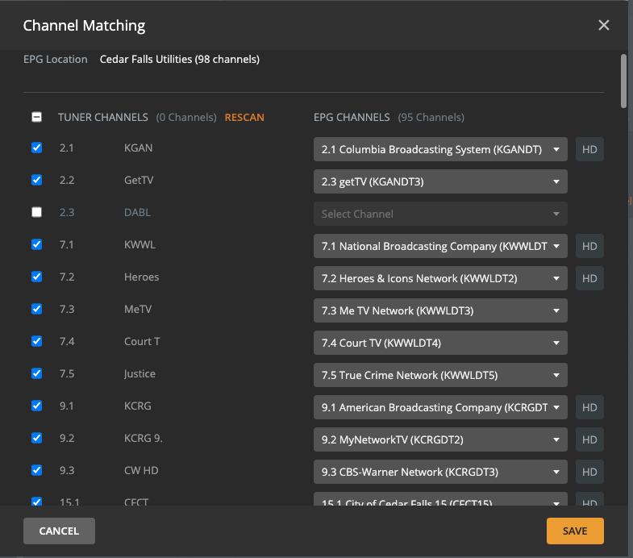
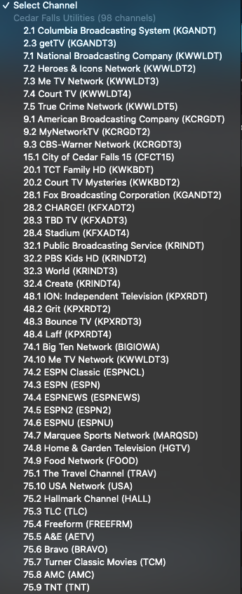
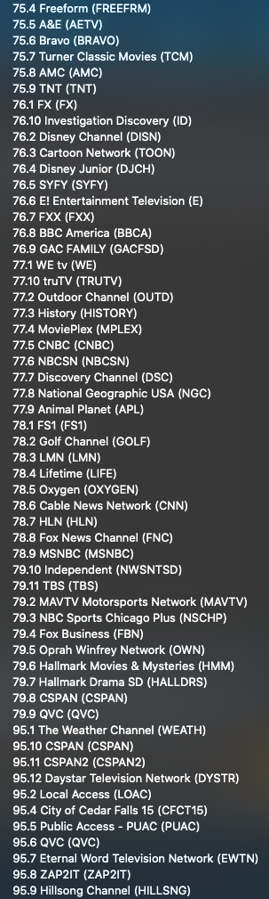

Plex and Silicondust

## Silicondust
- [https://www.silicondust.com/](https://www.silicondust.com/)
- [HDHomeRun Developer Documentation](https://github.com/Silicondust/documentation/wiki)
- [Silicondust Form](https://forum.silicondust.com/forum/search.php)
- [https://info.hdhomerun.com/info/dvr_api](https://info.hdhomerun.com/info/dvr_api)
- [tbd]()
- [tbd]()

## Plex
- [https://www.plex.tv/](https://www.plex.tv/)
- [plexopedia disable-video-transcoding](https://www.plexopedia.com/plex-media-server/general/disable-video-transcoding/)
- [https://developers.plex.com/](https://developers.plex.com/)
- [HDHomeRun Development Guide - pdf](https://www.silicondust.com/hdhomerun/hdhomerun_development.pdf)
- [Plex DVR - There was a transcode error](https://www.reddit.com/r/PleX/comments/6j9g4t/plex_dvr_there_was_a_transcode_error/)
- [Recording using HTTP download - HDHomeRun Prime](https://forum.silicondust.com/forum/viewtopic.php?t=13625&start=30)
- [tbd]()
- [tbd]()

## Plex channel mapping for HDHomerun
- [how_to_fix_missing_channels_in_the_dvr](https://www.reddit.com/r/PleX/comments/7lr0fi/how_to_fix_missing_channels_in_the_dvr/)
  - Find com.plexapp.plugins.library.db in C:\Users\account\AppData\Local\Plex Media Servers\Plug-in Support\Databases
  - Open table media_providers_resources on the row with identifier tv.plex.grabbers.tunerservice find the data column
  - [tv.plex.grabbers.tunerservice data column](https://pastebin.com/FyZDqkCv)
  - [XML blob change for tv.plex.grabbers.tunerservice](https://pastebin.com/Yw7kKGzK)
- [Channels not showing up on tuner scan](https://forums.plex.tv/t/bug-report-with-solution-channels-not-showing-up-with-wintv-dualhd/210416/10)
- [plex-dvr-unencrypted-channels-showing-as-protected](https://forums.plex.tv/t/plex-dvr-unencrypted-channels-showing-as-protected/199854)

## DVR Network Current [http://24.149.23.184/](http://24.149.23.184/)
- [ng.cfu.net - 854G-1 - http://192.168.6.1/](http://192.168.6.1/)
  - [devices on 192.168.6.0/24](http://192.168.6.1/#/html/status/status_devicetable.html)
  - [LAN port status](http://192.168.6.1/#/html/status/status_lanstatus_ipv6.html)
  - [NAT Table status](http://192.168.6.1/#/html/status/status_nattable.html)
  - [DMZ Host](http://192.168.6.1/#/html/advanced/security/advanced_security_dmzhosting.html)
  - [FireWall Filters](http://192.168.6.1/#/html/advanced/security/advanced_security_firewallsettings.html)
  - [PortForward](http://192.168.6.1/#/html/advanced/security/advanced_security_advancedportforwarding.html)
  - [tbd]()
  - [tbd]()
- [ng.cf.lan - ASUS RT-AC87U - http://192.168.2.1/](http://192.168.2.1/)
  - [Port Forward](http://192.168.2.1/Advanced_VirtualServer_Content.asp)
  - [Port Trigger](http://192.168.2.1/Advanced_PortTrigger_Content.asp)
  - [DMZ](http://192.168.2.1/Advanced_Exposed_Content.asp)
  - [DHCP](http://192.168.2.1/Advanced_DHCP_Content.asp)
  - [tbd]()
  - [tbd]()
- [plex global - https://www.plex.tv/](https://www.plex.tv/)
- [plex on local - http://127.0.0.1:32400/](http://127.0.0.1:32400/)
- [plex on catmini - http://192.168.2.35:32400/](http://192.168.2.35:32400/)
- [plex on admin2cld-win10 - http://192.168.6.15:32400/](http://192.168.6.15:32400/)
- [HDHomeRun Connect 4K Dev - Tuner - http://192.168.2.31/](http://192.168.2.31/)
  - [http://192.168.2.31/discover.json](http://192.168.2.31/discover.json)
  - [http://192.168.2.31/lineup.json](http://192.168.2.31/lineup.json)
  - [https://api.hdhomerun.com/api/xmltv?DeviceAuth=EB0wFJ8-Bct5BY-ZS8mF5XRO](https://api.hdhomerun.com/api/xmltv?DeviceAuth=EB0wFJ8-Bct5BY-ZS8mF5XRO)

- was [HDHomeRun Connect 4K - Tuner - http://192.168.2.87/](http://192.168.2.87/)
- [HDHomeRun Connect 4K - Tuner - http://192.168.6.14/](http://192.168.6.14/)
- [HDHomeRun SERVIO - DVR Storage - http://192.168.2.29/](http://192.168.2.29/)
  - [http://192.168.2.29/recorded_files.json](http://192.168.2.29/recorded_files.json)
  - [Forum - Storage space file usage API](https://forum.silicondust.com/forum/viewtopic.php?p=379950&hilit=lineup.json#p379950)

---

- Plex on admin2cld-win10
- [hardware-requirements-for-running-a-plex-media-server-with-transcoding](https://www.servermania.com/kb/articles/what-are-the-hardware-requirements-for-running-a-plex-media-server-with-transcoding/)

---

- Configure tuner guide mapping through plex

## OpenVPN Tunnel
- [CFU-Router](http://192.168.6.1/#/html/advanced/security/advanced_security_firewallsettings.html)
- [http://192.168.2.1/Advanced_VPN_OpenVPN.asp](http://192.168.2.1/Advanced_VPN_OpenVPN.asp)
- [ASUS - How to set up VPN server with port forwarding](https://www.asus.com/support/FAQ/1033906)
- [Youtube - RT-AC68U OpenVPN Setup](https://www.youtube.com/watch?v=KXdhhuBcpgU)

## [LON.tv - youtube silicondust guy](https://www.youtube.com/user/LonSeidman/videos)
- [https://shop.silicondust.com/shop/](https://shop.silicondust.com/shop/)
- [How to Customize and Adjust the Plex Interface on Televisions](https://youtu.be/DKvRXSCpWVE?list=RDCMUCymYq4Piq0BrhnM18aQzTlg)

- [plex server delete and reclaim](https://support.plex.tv/articles/204281528-why-am-i-locked-out-of-server-settings-and-how-do-i-get-in/)
- [tbd]()
- [tbd]()
- [tbd]()

## Video Arch
- [ThriftyAV - Capture Cards](https://www.youtube.com/c/ThriftyAV/videos)
- [Record HDMI](https://www.youtube.com/watch?v=LZ05aVBbHD4&t=188s)
- [Record HDMI](https://www.amazon.com/gp/product/B08XYGN2WM)
- [Record HDMI](https://www.amazon.com/gp/product/B08T1PT4P4) - [Review](https://www.youtube.com/watch?v=nEo-H6ZNkYk)
- [HDMI Spliter](https://www.amazon.com/gp/product/B092VJXGJ6)
- [HDCP Issues](https://www.youtube.com/watch?v=k6TKeMhxbdw)
- [HDCP Issues](https://www.youtube.com/watch?v=qAJL8pc85lo)
- [HDMI Splitter with Audio](https://www.amazon.com/gp/product/B00BIQER0E)
- [HDMI 4K Full HD 1080p60 USB Game Capture](https://www.amazon.com/dp/B0763TFZWT)

