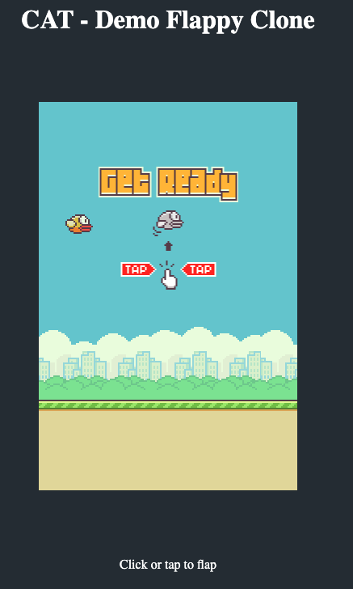
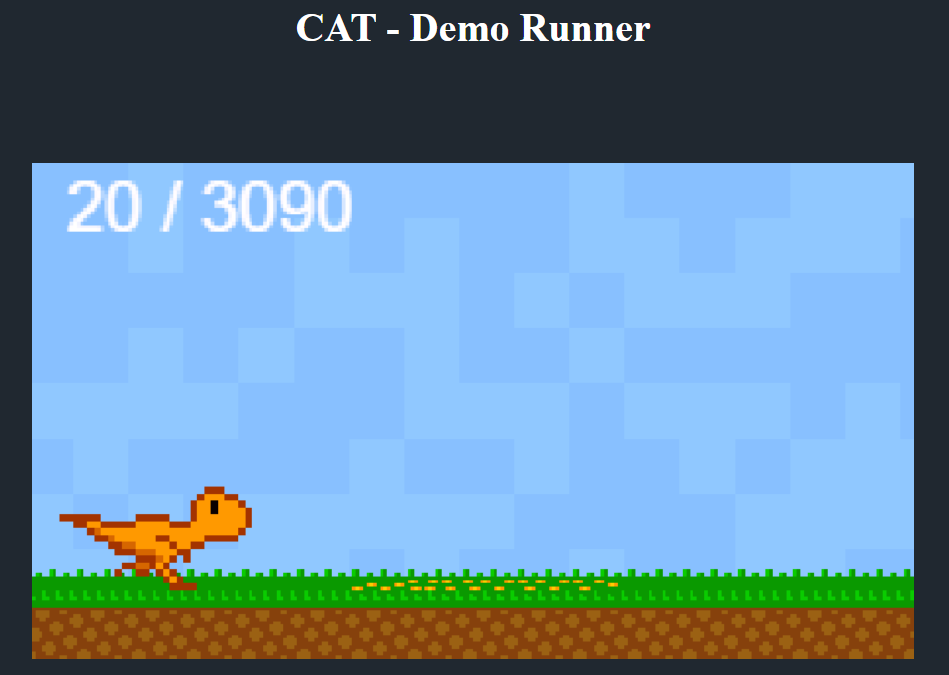

# Custom js and chrome hacks

## Flappy Bird clone js code
- [CATFlappyCustom](flappy)

---

## CATDino custom js code

- [CATDino Game custom js Live Demo](runner)
- [CATDino Game code github](https://github.com/christrees/blog/tree/master/game/runner)
- [CATDino Game code sprite file Line 497](https://github.com/christrees/blog/tree/master/game/runner/runner.js)
   - Line 497 display.tile_sheet.image.src = "catrunner.png";
   - Line 497 display.tile_sheet.image.src = "runner.png";
   - 

### CAT Dino High Score 3090

---

## Google Chrome Dino Game hacks

- [Dino Game Google](chrome://dino) - chrome://dino

## Dino AI
- [Dino AI github](https://github.com/nicknochnack/DinoAI)
- [Dino AI tutorial](https://www.youtube.com/watch?v=vahwuupy81A)
- [Install pytesseract](https://pythonforundergradengineers.com/how-to-install-pytesseract.html#:~:text=Create%20a%20Python%20script%20%28a%20.py-file%29%2C%20or%20start,r%20indicates%20the%20string%20is%20a%20raw%20string.)
