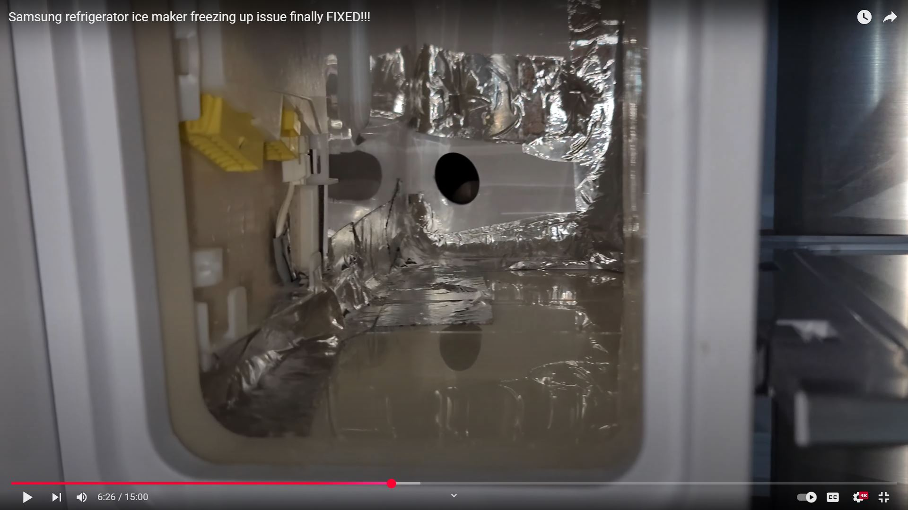

[edit](https://github.com/christrees/blog/edit/master/share/DP/README.md)

# DP
Darrell Preece (DP) 
160 Nawiliwili St
Honolulu HI, 96825-2044

Hawaii Kai Vet 
808.395.2303

<!--
Adrian 808.778.8883 
Michelle 808.445.8593 
Katie 408.887.5361 safeway
Danny 808.557.9222
-->

## DP notes

Projects
- 2 4x6 Storage Tote Rack
  - [Website ](https://www.ana-white.com/woodworking-projects/free-diy-tote-storage-rack-configurator-and-plans-ana-white)
  - Done [Pictures](https://photos.app.goo.gl/8TR5h2wcZffJWqHz6)
- Install under Cabinet lighting
  - Clear shelfs to access electrical
  - Setup test strips
  - Cut and wire
  - Drill and route
  - Wire and test
  - Mount lights
  - DONE [Pictures](https://photos.app.goo.gl/4R7sKfe2Rduqd4iEA)
- Kitchen fixes
  - Dimmer for under cab leds
  - Remove old Tfrm power
  - Fix wall and ceiling patcher (Mud)
  - Sand and smooth (pre-paint prep)
  - Clean lights, caulk backsplash
  - InProgress Pictures
- DP / guest bath
  - clean calcium
  - calk backsplash
  - ToDo Pictures
- Robot Pool
  - [Seagull pro knob issue](https://www.google.com/search?q=aiper+seagull+pro+knob+won+t+turn&sca_esv=c6dd72dbb1931884&sxsrf=AHTn8zpwTVkeJH-vcJq-v9HzUCvugjR7bg%3A1742581009371&ei=Ea3dZ9a2FoT6kPIPp9TVkQw&oq=aiper+seagull+pro+cannot+turn&gs_lp=Egxnd3Mtd2l6LXNlcnAiHWFpcGVyIHNlYWd1bGwgcHJvIGNhbm5vdCB0dXJuKgIIAjIGEAAYFhgeMgYQABgWGB4yBhAAGBYYHjIGEAAYFhgeMggQABgWGAoYHjILEAAYgAQYhgMYigUyCBAAGIAEGKIEMggQABiiBBiJBTIIEAAYogQYiQUyCBAAGKIEGIkFSNR1UJIPWMNMcAF4AZABAJgBnwGgAeAMqgEEMC4xMrgBAcgBAPgBAZgCDaACvw3CAgoQABiwAxjWBBhHwgINEAAYgAQYsAMYQxiKBcICDhAAGLADGOQCGNYE2AEBwgIWEC4YgAQYsAMYQxjlBBjIAxiKBdgBAcICGRAuGIAEGLADGNEDGEMYxwEYyAMYigXYAQHCAgoQABiABBhDGIoFwgILEAAYgAQYsQMYgwHCAgUQABiABMICChAAGIAEGBQYhwLCAg4QLhiABBixAxiDARjlBMICBBAAGAPCAh0QLhiABBixAxiDARjlBBiXBRjcBBjeBBjgBNgBAcICBRAhGKABmAMAiAYBkAYTugYGCAEQARgJkgcEMS4xMqAHsVWyBwQwLjEyuAe3DQ&sclient=gws-wiz-serp)
  - Pool bot [bearing replacement](https://www.ifixit.com/Guide/Aiper+Seagull+Pro:+Button+bearing+replacement/177344)
  - Pool bot [bearing picture](https://guide-images.cdn.ifixit.com/igi/xyMEtmhBToKOGZcR.huge)
  - Pool bot [repair breakdown](https://www.youtube.com/watch?v=iu2WZWz4rhU)
  - NA push ring up and down to get bearing to release, I'm guessing it just gets stuff into it
- Garage Ref Fix
  - Samsung: RF23HCEDBSR/AAff
  - Sounds like DP's issue [FixDefrost](https://www.justanswer.com/appliance/bylb7-samsung-refrigerator-rf23hcedbsr-aa-it-s.html)
  - [Manual](https://www.manualslib.com/manual/1228428/Samsung-Rf28hmedbsr.html?page=54#manual)
  - Samsung refrigerator [Ice Maker Seal with Al-Tape youtoube tc:06:25](https://youtu.be/ND-2Nkp1ItM?t=385)
    - Image Icemaker seal
    - 
  - Samsung refrigerator [Bens Appliance and Junk](https://www.youtube.com/@bensappliancesandjunk/search?query=Samsung%3A%20RF23HCEDBSR)
  - Samsung refrigerator [ice maker freezing up issue finally FIXED](https://www.youtube.com/watch?v=ND-2Nkp1ItM)
  - Samsung refrigerator [Permanently stop your Samsung French door refrigerator from freezing and icing up - Super Cheap Fix](https://www.youtube.com/watch?v=l5beJp8amJU)
  - DONE [Pictures](https://photos.app.goo.gl/tf4KZxibs4HxitcF7)
- Dryer Cleanup
  - Mainly cleanup motor and runner bearings...
  - DONE [Pictures](https://photos.app.goo.gl/hLx1D3SMV8G8rLBx5)
- Tool Box Cleanup
  - Couldn't find stuff to fix other stuff... so
  - Sort Tools [Pictures](https://photos.app.goo.gl/fQ5QAgksq5mWspXz6)
  - Need final boxOcrap sort
- Squeeky Chair Fix
  - Disassembly [video](https://www.youtube.com/watch?v=U7lxOD9n8SQ)
  - ISSUE: squeak is between insert and base
  - ISSUE: Reapolster back
  - InProgress [Pictures](https://photos.app.goo.gl/kYSnJvwDCvP1Epio8)
- Move lumber to deck attic
  - Put as much reusable lumber as possible into attic
  - InProgress [Pictures](https://photos.app.goo.gl/Wfi4ijArtsJxDo7p6)
- Move garage light
  - Find Electrical breaker [Pictures](https://photos.app.goo.gl/oveUqfNVhTXgi5Vm9)
  - Find wire trace
  - Not started [Pictures](https://photos.app.goo.gl/oveUqfNVhTXgi5Vm9)

## [DP chores](./DPchores)

## Notes
- Hanauma Bay [youtube](https://www.youtube.com/watch?v=4g-OJ-jicxA)
- Hanauma Hike [Link](https://maps.app.goo.gl/DxWCMXU9w6EQ4ZfA6) to [Hanauma Bay State Park](https://hanaumabaystatepark.com/hanauma-bay-history/)
- DP neighborhood Hike [Link](https://maps.app.goo.gl/kZGW6qSNsashgSXSA)
- Public Beach Hike [Link](https://maps.app.goo.gl/PC5yYnen51jMH7Hn6)
