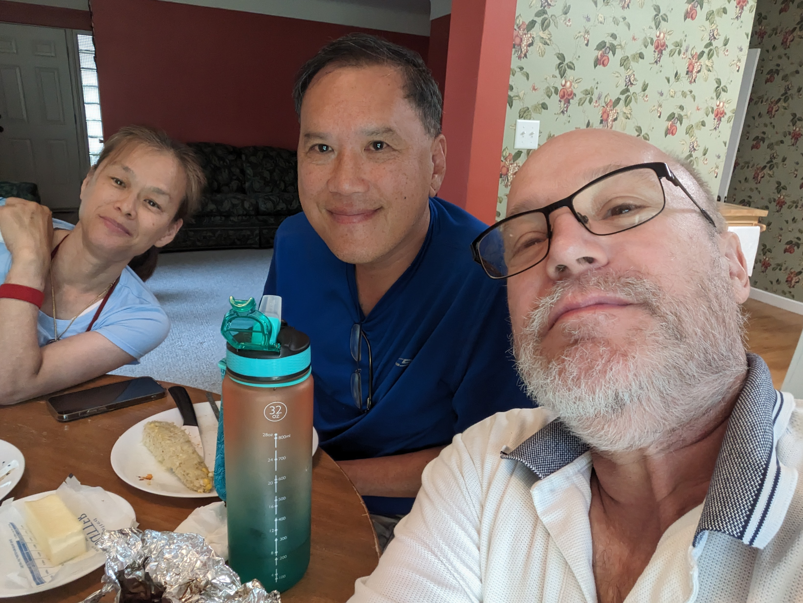

[edit](https://github.com/christrees/blog/edit/master/share/README.md)

- [Dutoit](./Dutoit)
- [Jordan](./Jordan)
- [MikeTrees](./MikeTrees)
- [Nordyke](./Nordyke)
- [Sander](./Sander)
- [TaedWynnell](./TaedWynnell)
- [Trink](./Trink)
- [Tu](./Tu)

## [Tu Visit Crooked Creek Days](./Tu) - 2023.08.06

## [KeithAtPuppetJustice](./KeithAtPuppetJustice) - 2020.09.05

Keith and Chris on the Puppet Justice Set.

## Kyle Edgar Shayne Meetup Trifecta Challenge
My Trifecta Challenge entry - 8 days (6 days but no Shayne picture)

- Day 8: 2018.12.17 - Shayne's Hen House

- Day 2: 2018.12.11 - Edgar Fish Market

- Day 0: 2018.12.09 - Kyle Hobbies

- Day -4: 2018.12.05 - Shayne House, he takes me to DSM to start the trip

---

## Older stuff

<a href="http://christrees.com">Back to christrees.com</a>
 

<h1>CAT Tails</h1>
  <ul>
    <li><a href="http://blog.christrees.com/2018/10/14/">Fletcher: A Cardinal in Vikings Territory</a></li>
    <li><a href="http://blog.christrees.com/2018/11/22/">Jordan: Thanksgiving in West Bend Wisconsin</a></li>    
    <li><a href="http://blog.christrees.com/share/MikeTrees/">Mike Trees: with grandsons</a></li>
    <li><a href="https://www.fs.usda.gov/research/about/people/nklopfenstein#highlights-tab">Ned Klopfenstein - USDA.gov</a></li>
  </ul>
</body>
</html>
