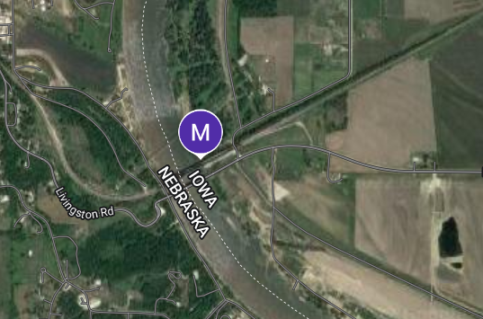
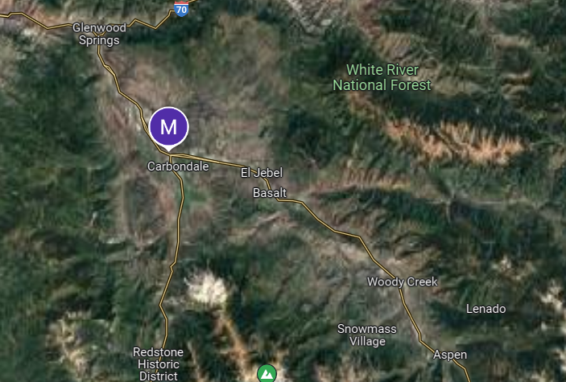
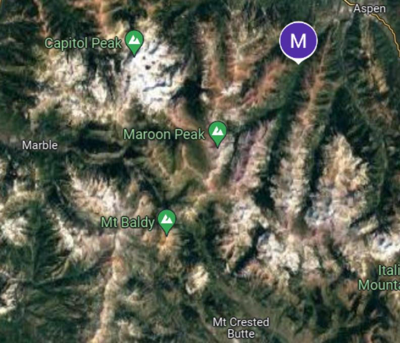
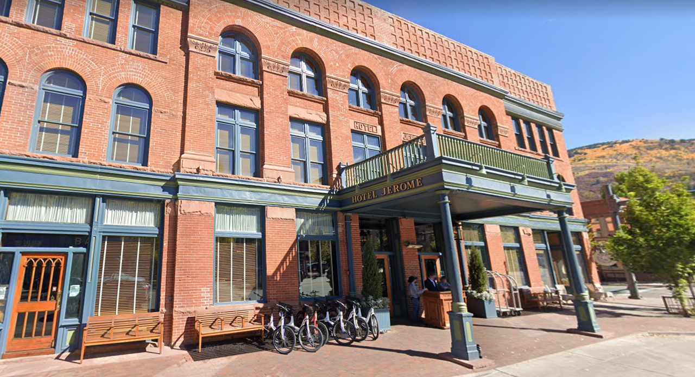
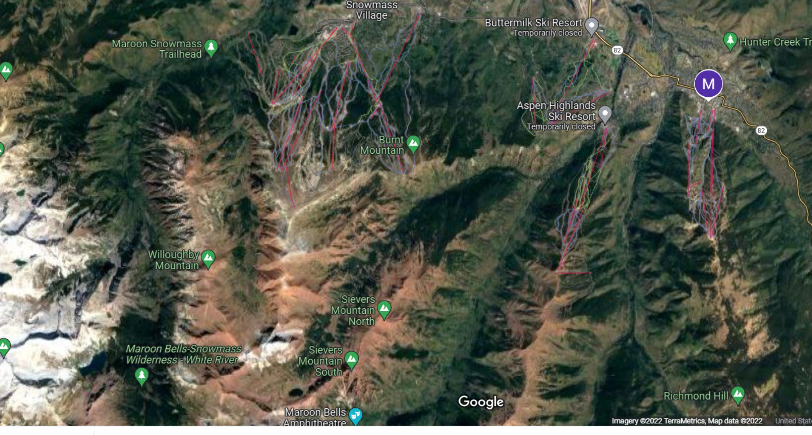
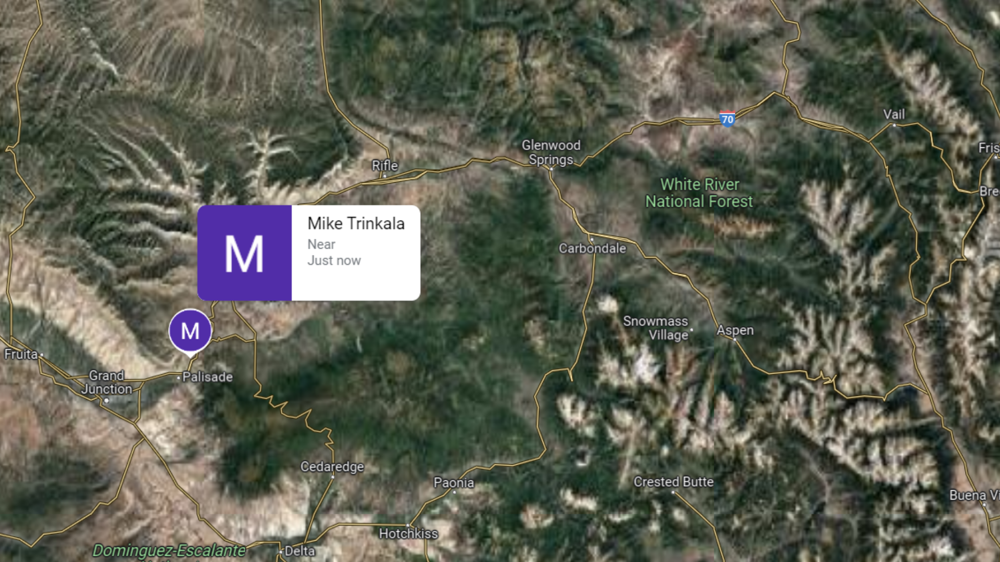

## Trink Train and Hike
Trink is on a new train and hike trip.  So I get to track progress and get a virtual trip.
#### 2022.08.10 10:20am CST - Cross into Iowa

#### 2022.08.09 10:30am CST - Back to Amtrak

#### 2022.08.08 4:14pm CST - Cowboy Campsite

#### 2022.08.07 7:30pm CST - Hiked out of cell coverage
 - [FCC Cell Coverage Map](https://fcc.maps.arcgis.com/apps/webappviewer/index.html?id=6c1b2e73d9d749cdb7bc88a0d1bdd25b)

#### 2022.08.07 5:58pm CST - Jerome Hotel

#### 2022.08.07 5:20pm CST

#### 2022.08.07 2:10pm CST

