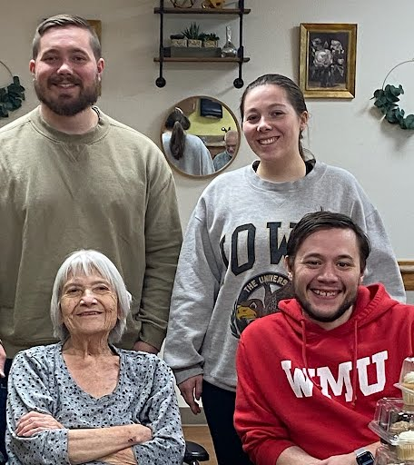

# Mom

---
Alice Trees Obituary

Alice Trees, 86, of Winfield, passed away on Wednesday, March 29, 2023, at Sunrise Terrace in Winfield. Visitation will be held from 4 to 7 pm Tuesday, April 18 at Snyder Funeral Services in Winfield.  Memorial services will be held at 3:00 pm on Sunday, April 23, 2023, at the Winfield United Methodist Church. Immediately following the services, a time of food and fellowship will be held at the church. Online condolences may be left for the family at [https://www.sandhfuneralservice.com/obituary/Alice-Trees](https://www.sandhfuneralservice.com/obituary/Alice-Trees)

Alice Anne Klopfenstein was born on April 8, 1936, at home to Fred and Hazel (Fletcher) Klopfenstein of Winfield Iowa. Alice was a graduate from Winfield High School and Iowa State University where she received a degree in Home Economics.

On March 23, 1957, Alice was united in marriage to Alan Trees at the United Methodist Church in Winfield.  While Alan finished his degree at ISU and to help develop the right recipe,  Alice taught Home Economics in Radcliff, Iowa.  

After college, the newlyweds moved to Fort Atkinson, Wisconsin.  In 1959 Alan worked for Jamesway Manufacturing Company and Alice baked their first creation called Carla.  Once Alice discovered baked custard could appease a creation of “C”, another was baked and in 1962 they named him Chris.  With double “C’s” in-hand the double “A’s” moved back to Winfield.  Then in 1965 one final creation, Carol, completed a triple “C”.  Then all of the “C’s” went off to get schooled, Alice herself went back there too, Teaching Home Economics at the Washington School.  

When time had passed and only Carol remained, team “A” opened a shop and called it CounTREEStore.   Not only that, to entertain all they also imported a Dutch treat named Anne-Marie (Chris called her Joe).  The double-triple was completed, 3 “A’s” and 3 “C’s”.

Alice was a member of the Winfield United Methodist Church, UMWA, TTT, and served on the Henry County Fair and Winfield Library boards. She enjoyed being involved with any activity that included her grandchildren and traveling with Alan (and others) in their RV all over the continental US. And yes, doughnuts were made. 

Alice will be deeply missed by her children, Carla (Brian) Trees of Winfield, Chris (Andrea) Trees of Cedar Falls and Carol (Brad) Fletcher of Cedar Falls; three grandchildren, Brennan Lee-Trees Haymond and Clint and Emma Fletcher; Dutch exchange student, Anne-Marie Herlaar (Jacques) Dutoit and her children, Kimberly, Bastian and Louise; sisters-in-laws, Carol Klopfenstein and Ruth Klopfenstien; brother, Joe Klopfenstein; and the entire cast of nieces and nephews Steve (Dixie) Klopfenstein, Kim (Laurie) Klopfenstein, Ned (MeeSook) Klopfenstein, Paul (Carrie) Klopfenstein, Rex Klopfenstein, Betty (Gary) Metz, Sara (Tim) Tuschen, Neil (Chip) Klopfenstein and Jim (Sue) Klopfenstein, Candy (Ron) Fjetland, Neal Rabe, Mike (Colleen) Trees, Diane Erickson, David (Aya) Trees, Dena Trees.

Alice was preceded in death by her husband Alan, parents Fred and Hazel Klopfenstein and brothers, Phil and Bill Klopfenstein, sister-in-laws Lenore (Bill) and LeVonne (Phil) Klopfenstein; in-laws Paul and Marge Trees, Tim and Marilyn Trees; nephew Terry Trees and niece Cindy Rabe.

---

- Mom with Grandkids Clint, Emma and Bren on Bren's late birthday.

## Photo Albums
- Neighborhood [Doughnut Day 2023](https://photos.app.goo.gl/TYXZyh8NqAhyKYfcA)
- Klopfenstein [Christmas 2022](https://photos.app.goo.gl/iispBFd3vk1gQaha6)
- Fletcher [Turkeyday 2022](https://photos.app.goo.gl/WS6y4WRgFWkejYpJ6)
- Nordyke [Visit](https://photos.app.goo.gl/RuKLffYGoJsChz2o9)
- Neighborhood [Doughnut Day 2022](https://photos.app.goo.gl/6BFqK9CZsu2TtYAR6)
- Kimberly and Jeromy [Frenchie Visit 2019](https://photos.app.goo.gl/iUtaWXfxQqb4cCjt8)
- Laurie Klopfenstein [HOME Art Share](https://photos.app.goo.gl/sc5tBm4kf2wFcLSX8)

