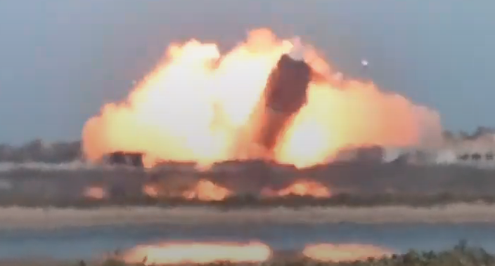

# Space, the ~~final~~ other frontier

## 2021-08-06 Starship SN20 Super Heavy Stacking

## 2021-02-02 Starship SN9 Flight test
- [NASA - Starship SN9 Flight Test](https://youtu.be/wfHqbahPKpY)
- [SpaceX - Starship SN9 Flight Test](https://youtu.be/_zZ7fIkpBgs)
    - [Blast OFF - T -0:02](https://youtu.be/_zZ7fIkpBgs?t=323)
    - [Apogee hover - T +4:01](https://youtu.be/_zZ7fIkpBgs?t=568)
    - [Belly flop begin - T +4:33](https://youtu.be/_zZ7fIkpBgs?t=599)
    - [Landing flip - T +6:18](https://youtu.be/_zZ7fIkpBgs?t=704) you can see engine fail to start
    - [Crash land - T +6:24](https://youtu.be/_zZ7fIkpBgs?t=710)

## 2020-12-21 Jupiter Saturn Conjuction
All December closest on 12-21 view SW sky 1 hr after sunset but sets 2 hrs after sunset.

## Chris watches crewdragon 1

- Video [chris watches crewdragon 1 approach and dock](https://youtu.be/5XWF8bvF8Aw)
- Video [chris watches ISS crew prep access hatches](https://youtu.be/69FebfNMju0)
- Video [chris watches crewdragon 1 enter ISS](https://youtu.be/CozfE08jrZ4)

## Crew Dragon 1 Docked

## Crew Dragon 1 ISS Entry

