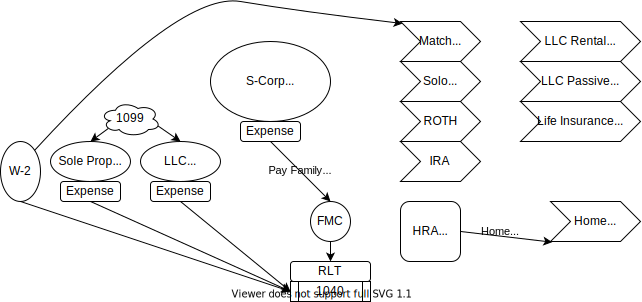

# TAX Plan Structure

The metric of tax planning is the 1040.
The goal is to maximize future personal value through current income tax rule incentives. 
Successful planning requires consistant objective data monitoring that can be used to evaluate planned expections vs actual.  
The 1040 report is a consistant actual evalutaion point, use the 1040 data flow.

- 1040 as a RLT (Revocable Living Trust)
- Family Management Company (FMC) for Services
    - Children under 18 can be paid through a FMC for legitimate services
    - Health Reimbursement Arrangement (HRA) Pay spouse or children
    - May create a C-Corp to work with S-Corp if single with lot of medical expense
    - Write off Medical Insurance in S-Corp
- Income to 1040
    - W2 Normal Job
    - 1099 Sched C - Sole
    - 1099 Sched C - LLC
    - W2 S-Corp - Draws (save on SE Tax max write offs)
    - Maximize write offs in all
- Profits
    - Solo 401K
    - Roth IRA
    - Trad IRA
    - HSA (Health Savings Account)
    - Home Ownership (Trust owns)
    - Fund other LLC to buy Rentals
    - Fund Life Insurance (Term)

[FedTax1040Structure - draw.io source](FedTax1040Structure.drawio)

# Bank Structure [example](https://youtu.be/j--cvfqcwxo?t=745)
- Life Insurance Premium (one payment) $30,000 (2% return)
- Non Guar. Cash Value (get loan against) $27,537
- Base (10-40%) and P.U.A. (90-60% Paid up Annuity) accounts for 100% of Premium and is how tax rules, commission and annuity is paid.  This balance is key for personal banking design.
- D.B. (Death Benifit) is not the objective, but the core 200 year old rule that allows the leverage for everything else.  Basically it is the future leverage point for current planning.  Repayment risk for loan today is leveraged agaist future death asset tomorrow, which is leveraging statistics with a better hedge.
- Use loan up to $27,527 to fund an LLC and 'buy higher int debt' from youself AND pay the LLC the same debt payment.
- Repeat with same LLC until the P.U.A. have exhausted it's tax rule (~ 5yrs ?)
- With extra cash from above, repeat with new Life Insurance Premium payment and new LLC
- Depending on legacy planning it may be better to put Life Insurance on people still earning money with additional legacy (aka grandparents buy life policy on kids with grandkids with grandkids as benificiaries then cycle kids debt through new llc). 

### Notes
- RLT requires Trust and Will documents
- [shorttermrental accel dep](./shorttermrental) turn non-primary into short term rental
- LLC to S-Corp when to swithch over 50K [youtube example](https://www.youtube.com/watch?v=LUpyc89bgBU)
- [Medicad recipient claw back - Life Insurance](https://wisconsinexaminer.com/2021/11/11/draft-bill-would-limit-what-state-can-claw-back-when-medicaid-recipients-die/)
- Why a Living Trust which explains the above diagram [youtube](https://www.youtube.com/watch?v=je9Z1BJSCAU)
- Why Life Insurance as Bank [youtube](https://www.youtube.com/watch?v=j--cvfqcwxo)
- [Live Insurance Dividends explained](https://www.forbes.com/advisor/life-insurance/life-insurance-dividends/)
