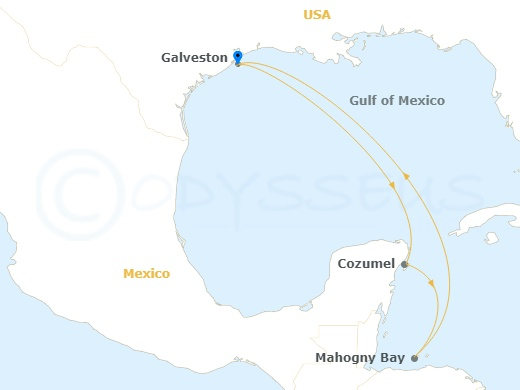

# Jan

# Feb

| Flight | Time | Date | From To | Arrive |
|--------|------|------|---------|--------|
| AA 2753 | 5:15 AM | 2026.02.06 Fri | CID DFW | 7:46 AM |
| AA 2753 | 8:45 AM | 2026.02.06 | DFW HOU | 10:05 AM |

- Flight [American Airlines Reservation](https://www.aa.com/reservation/findReservationAccess.do?recordLocator=DQCDTN&c=EML|PDP|20241211|MKT|USMCOC|CX|TRF|US_TRAN_EVG_TRAVEL_REMINDER_SSR_GSA)
  - Confirmation code DQCDTN
- Hotel Galveston [Booking](https://secure.booking.com/confirmation.en-us.html?bn=5024269187&pbsource=conf_email_modify&pbtrack=email_mainCTA&source=conf_email&from_conf_email_tracking=1&from_conf_email_source=1&blockout_source=1&from_conf_email_apps=1&mp_blockout_cta_track_non_pbb=non_pbb_button_change_book_cta) Confirmation: 5024269187 <!-- 0181 -->
  - Reservation details
  - Check-in	Friday, February 6, 2026 (from 4:00 PM)
  - Check-out	Sunday, February 8, 2026 (until 11:00 AM)
  - reservation	2 adults 2 nights, Queen Room with Two Queen Beds - Non-Smoking
  -	2826 63rd Street, Galveston, TX 77551, United States
  - Phone	+1(409) 744-3000
- Princess Cruise [Booking](https://bookus.cruisedesk.com/web/customer/booking_details.aspx?bData=AdQ62TwQYWdhJ1yeyVtj-BF3I0T9_uyTQ-SvSeKOfpCTHdUlYwPaP7VOP4URDmhpqgmCc4na6Uz13vdXCjH9uQ&brn=WEB2040.96258018443481147ef48b0eddc4ef3a17b123b3e9434cckj0ermaacgeqf0xqftdpktnx1048354)
  - Thank you for choosing Expedia Cruises for your booking. Please note the following details for follow-up:
  - Your Confirmation #: FBGAZTH
  - Your Princess Itinerary #: DR3W8K

| Day - Location | Date | Time |
|----------------|------|------|
| Day 1: Galveston, Texas | Feb 08, 2026 | Depart 03:00 PM |
| Day 2: Day At Sea | Feb 09, 2026 | all day |
| Day 3: Cozumel, Mexico | Feb 10, 2026 | Arrive 09:00 AM |
| Day 4: Cozumel, Mexico | Feb 11, 2026 | Depart 05:00 PM |
| Day 5: Roatan (Mahogany Bay), Honduras | Feb 12, 2026 | 09:00 AM To 06:00 PM |
| Day 6: Day At Sea | Feb 13, 2026 | all day |
| Day 7: Day At Sea | Feb 14, 2026 | all day |
| Day 8: Galveston, Texas | Feb 15, 2026 | Arrive 07:00 AM |

| Flight | Time | Date | From To | Arrive |
|--------|------|------|---------|--------|
| AA 5301 | 6:00 AM | 2026.02.17 Tue | HOU DFW | 7:29 AM |
| AA 2532 | 10:35 AM | 2026.02.17 | DFW CID | 12:39 PM |

- Flight [American Airlines ](https://www.aa.com/reservation/findReservationAccess.do?recordLocator=DQCDTN&c=EML|PDP|20241211|MKT|USMCOC|CX|TRF|US_TRAN_EVG_TRAVEL_REMINDER_SSR_GSA)

