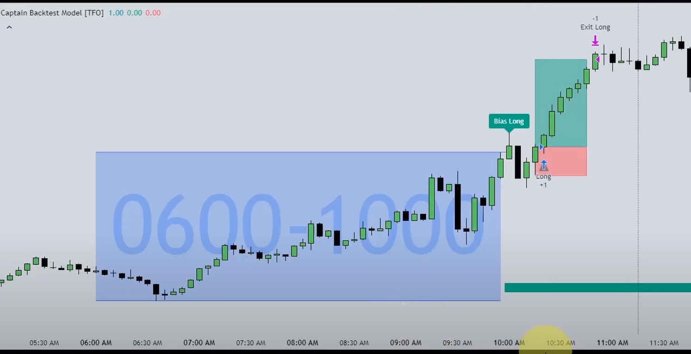

[edit](https://github.com/christrees/blog/edit/master/trade/bot/nijatrader/README.md)

## catSimple
- [NijaTrader Bot - youtube](https://www.youtube.com/watch?v=IYYQZ3ERAKI)
- Open NijaTrader desktop
- New -> Strategy Builder
- New Strategy -> Next
- Name: catSimple see [catSimpleUnlocked.cs file](./catSimpleUnloced.cs)
- Inputs FastMA 9 1, SlowMA 21 1
- Next, Next, Next Finish 
- Open Strategy Builder again, find catSimple save as catSimpleUnlocked click unlock code
- The standard location for strategy .cs files would be: Documents\NinjaTrader 8\bin\Custom\Strategies
- [Backtesting](https://youtu.be/IYYQZ3ERAKI?t=561)

## TadingView NijaTrader [Captain Backtest Model TFO - TradingView](https://www.tradingview.com/script/tOQ8gnxj-Captain-Backtest-Model-TFO/)

1. Mark the highest high and the lowest low of 0600 and 969.  This is the playground.  You could also look to see if it took out the prev d or weekly hi/lo as confluence.
2. After 1000 wait for one of the hi/lo to get taken out.  This is the bias and it doesn't change period.  This needs to happen before 1115.  If it doesn't happen before 1115 abort any trades for the day.  The day is showing chop.
3. Wait for it to retrace and on the m5 candle have an alert set on prev m5 hi/lo.  To meet the entry criteria a close above/below that must happen.  You can enter with a buy/sell stop at that level or jump to a ltf to get a more ideal entry.  The key is entry 5/8

- [cat TradingView](https://www.tradingview.com/chart/wvwO4ekm/?symbol=CME_MINI%3ANQ1%21)

### Captain Backtest ninj
- [Captain Backtest Model TFO - TradingView](https://www.tradingview.com/script/tOQ8gnxj-Captain-Backtest-Model-TFO/)
- [TV Source code - TV-CapBacktest.pine](./TV-CapBacktest.pine)
- [Code Part 1](https://youtu.be/WC3HBlhIbjI?t=1844)
- [Code Part 2  - OnStateChange if](https://youtu.be/WC3HBlhIbjI?t=1849)
- [Code Part 3  - OnStateChange else if](https://youtu.be/WC3HBlhIbjI?t=1864)
- [Code Part 4  - OnBarUpdate ](https://youtu.be/WC3HBlhIbjI?t=1876)
- [Code Part 5  - trade_range 1](https://youtu.be/WC3HBlhIbjI?t=1883)
- [Code Part 6  - trade_range 2](https://youtu.be/WC3HBlhIbjI?t=1888)
- [Code Part 7  - trade_range 3](https://youtu.be/WC3HBlhIbjI?t=1891l)
- [Code Part 8  - take_range](https://youtu.be/WC3HBlhIbjI?t=1900)
- [Code Part 9  - reset ](https://youtu.be/WC3HBlhIbjI?t=1904)
- [Code Part 10 - prev_range](https://youtu.be/WC3HBlhIbjI?t=1908)
- [Code Part 11 - took_trade](https://youtu.be/WC3HBlhIbjI?t=1912)
- [Code Part 12 - check_time](https://youtu.be/WC3HBlhIbjI?t=1917)
- [Code Part 13 - NinjaScriptProperty](https://youtu.be/WC3HBlhIbjI?t=147)
- [Code Part 14 - took_trade](https://youtu.be/WC3HBlhIbjI?t=167)
- [Code Part 15 - took_trade](https://youtu.be/WC3HBlhIbjI?t=179)
- [Code Part 16 - took_trade]()
- [Code Part 17 - took_trade]()
- [Code Part 18 - took_trade]()
- [Code Part 19 - took_trade]()

### Reference
- [TFO - Trading For Opp - youtube](https://www.youtube.com/@TradeForOpp/videos)
  - [TFO - Make a BOT - Ninja Trader Beginner](https://www.youtube.com/watch?v=IYYQZ3ERAKI)
  - [TFO - Indicator to BOT - Part 1](https://www.youtube.com/watch?v=3RtoarHIFTo)
  - [TFO - Indicator to BOT - Part 2](https://www.youtube.com/watch?v=WC3HBlhIbjI)
- [NijaTrader Training Videos](https://support.ninjatrader.com/s/video-guides?language=en_US)

#### Looked at maybe revisit
- [Do this Every Morning for Trading](https://www.youtube.com/watch?v=YaiLhrUfexY)
- [Create Foreex Trading Robot for Free - online heavy backtesting](https://www.youtube.com/watch?v=GE-t0oyGvrU)
- [Crypto Bot Trading in 100 Lines of Code](https://www.youtube.com/watch?v=GdlFhF6gjKo)
- [Terrible Trading Bot - Coding with Lewis](https://www.youtube.com/watch?v=zh008MNMOlo)
- 
