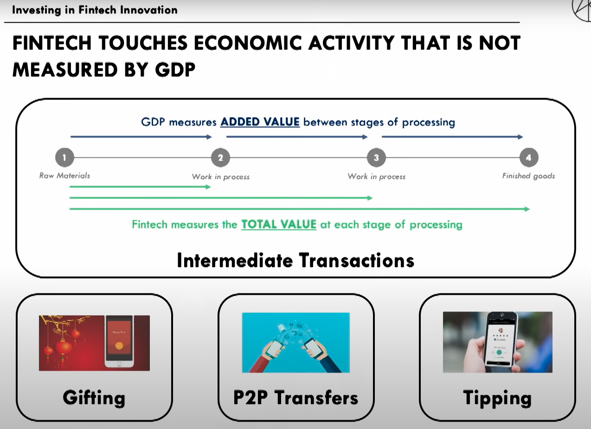

# Trading Sectors

 - SPX - S&P 500
    - XLY Discretionary
    - XLC Communication Services
    - XLK Technology
    - XLI Industirals
    - XLB Materials
    - XLE Energy
    - XLP Staples
    - XLV Health Care
    - XLU Utilities
    - XLF Financials
    - XLRE Real Estate

## [Where In Sector Rotation - youtube](https://www.youtube.com/watch?v=DqjBZWcwn2g)

- Sector Rotation Model Chart [Stockcharts - Sector Map](https://stockcharts.com/freecharts/perf.php?[SECT])
    - [Sector Rotation Review TC02:13](https://youtu.be/DqjBZWcwn2g?t=133)
    - [Use days range to show sector rotation TC07:40](https://youtu.be/DqjBZWcwn2g?t=460)
    - [Use data to identify where in the rotation we are TC10:04](https://youtu.be/DqjBZWcwn2g?t=604)
- Business Cycle [Fidelity Business Cycle Update](https://institutional.fidelity.com/app/item/RD_13569_40890/business-cycle-update.html)
    - [Use Fidelity chart TC10:29](https://youtu.be/DqjBZWcwn2g?t=629)
- Consumer Confidence [Conference Baord Consumer Confidence](https://conference-board.org/data/consumerconfidence.cfm)
    - [Use Conference Board to look at Consumer Confidence TC12:22](https://youtu.be/DqjBZWcwn2g?t=742)
- GDP [ceicdata production index growth](https://www.ceicdata.com/en/indicator/united-states/industrial-production-index-growth)
    - [Use ceicdata to look at GDP Data TC13:51](https://youtu.be/DqjBZWcwn2g?t=831)
- Interest Rates [stockmarketmba etf for rates](https://stockmarketmba.com/etfsforrisingrates.php)
    - [Use stockmarket mba to look at TNX for rates TC15:48](https://youtu.be/DqjBZWcwn2g?t=948)
- Yield Curve [gurufocus yield curve](https://www.gurufocus.com/yield_curve.php)
    - [Use gurufocus to look at yield curve via bonds TC16:50](https://youtu.be/DqjBZWcwn2g?t=1010)
- Sector Charting [sectorsprd charting](https://www.sectorspdr.com/sectorspdr/tools/sector-tracker/charting)
    - [Use Sector Tracker to look at charts for the sectors TC19:55](https://youtu.be/DqjBZWcwn2g?t=1195)
    
# Innovation Sectors [Cathie Woods ARK Invest](https://www.youtube.com/watch?v=eE6u67Ph768)

We are in a post-computer-interent digital innovation transformation.

- Blockchain Technology
  - Bitcoin
  - Etherium
  - Cordiano
- Artificial Intelligence
  - IoT
  - Value Transfer
  - Mobile Connected Devices
  - Cloud
  - IoT
- Robotics
  - Autonomus Vehicles
  - 3D Printing
  - Resuable Rockets
- Energy Storage
  - Battery Storage
  - Passive Design
  - Zero footprint Architecture
- Genome Sequencing
  - Immuno-Therapy
  - Genome Editing
  

