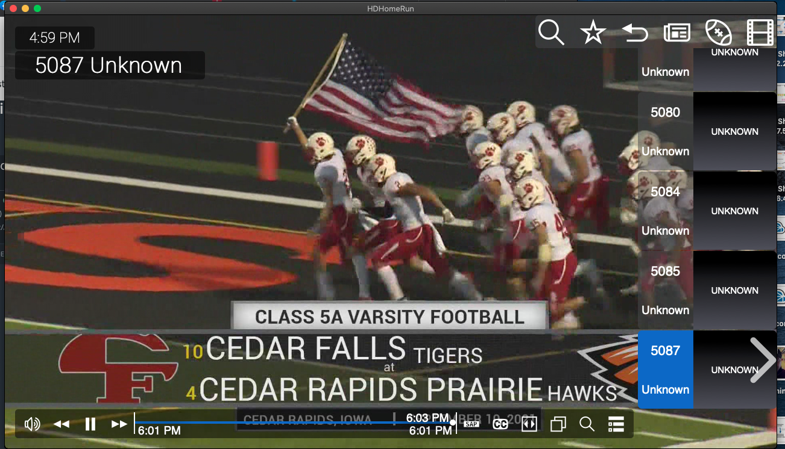

Plex and Silicondust

## OpenVPN Tunnel
- [CFU-Router](http://192.168.6.1/#/html/advanced/security/advanced_security_firewallsettings.html)
- [http://192.168.2.1/Advanced_VPN_OpenVPN.asp](http://192.168.2.1/Advanced_VPN_OpenVPN.asp)
- [ASUS - How to set up VPN server with port forwarding](https://www.asus.com/support/FAQ/1033906)
- [Youtube - RT-AC68U OpenVPN Setup](https://www.youtube.com/watch?v=KXdhhuBcpgU)

## [LON.tv - youtube silicondust guy](https://www.youtube.com/user/LonSeidman/videos)
- [https://shop.silicondust.com/shop/](https://shop.silicondust.com/shop/)
- [How to Customize and Adjust the Plex Interface on Televisions](https://youtu.be/DKvRXSCpWVE?list=RDCMUCymYq4Piq0BrhnM18aQzTlg)

## Video Arch
- [ThriftyAV - Capture Cards](https://www.youtube.com/c/ThriftyAV/videos)
- [Record HDMI](https://www.youtube.com/watch?v=LZ05aVBbHD4&t=188s)
- [Record HDMI](https://www.amazon.com/gp/product/B08XYGN2WM)
- [Record HDMI](https://www.amazon.com/gp/product/B08T1PT4P4) - [Review](https://www.youtube.com/watch?v=nEo-H6ZNkYk)
- [HDMI Spliter](https://www.amazon.com/gp/product/B092VJXGJ6)
- [HDCP Issues](https://www.youtube.com/watch?v=k6TKeMhxbdw)
- [HDCP Issues](https://www.youtube.com/watch?v=qAJL8pc85lo)
- [HDMI Splitter with Audio](https://www.amazon.com/gp/product/B00BIQER0E)
- [HDMI 4K Full HD 1080p60 USB Game Capture](https://www.amazon.com/dp/B0763TFZWT)

