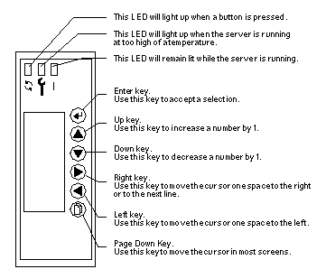

[blog.christrees.com](../)
# Work related history

## Trees Agricultural Engineering Services (Trees AES) - cheap labor 1976-1982

## Natural Gas Pipeline Company of America (NGPL) summer intern - 1983 and 1984

## Lockheed Missiles and Space Company 1985-1986

## The Engineering Department, Inc. 1986-1990

 - [Wendell Sanders - ISU interview with Apple I](https://www.youtube.com/watch?v=yMiFFxq4JBY)
 - [Wendell Sanders - DigiBarn](https://www.digibarn.com/collections/systems/appleIII/sandersinterview.html)
 - [Apple I - Dick and Cliff Hustion](https://en.wikipedia.org/wiki/Apple_I)
 - [IWM - Integrated Woz Machine](https://en.wikipedia.org/wiki/Integrated_Woz_Machine)
 - [Daniel Kottke](https://en.wikipedia.org/wiki/Daniel_Kottke)

## IKOS Systems, Inc.  1990-1991

## Hughes LAN 1992-1994

 - [Van Jacobson - TCPIP congestion control algorithms](https://en.wikipedia.org/wiki/Van_Jacobson)
 - [Pyramid Technology](https://en.wikipedia.org/wiki/Pyramid_Technology)

## Sun Netra i - 1994-1995 - BreadBox was the project [AndyB](https://en.wikipedia.org/wiki/Andy_Bechtolsheim)  left to form Granite Systems.

- [Netra 150](http://www.shrubbery.net/~heas/sun-feh-2_1/Systems/4u-Server/4uSERVER_Netra_150.html)
- [Netra E150](http://www.shrubbery.net/~heas/sun-feh-2_1/Systems/4u-Server/E150.html)
- [Sun Documents Operation of the LCD Panel](https://docs.oracle.com/cd/E19957-01/802-7555-10/z40005892557/index.html)

## General Magic - 1996-1997

## Vertical Networks - 1997-1999

### Original Proto of [Vertical Networks](http://www.verticalnetworks.com/)

